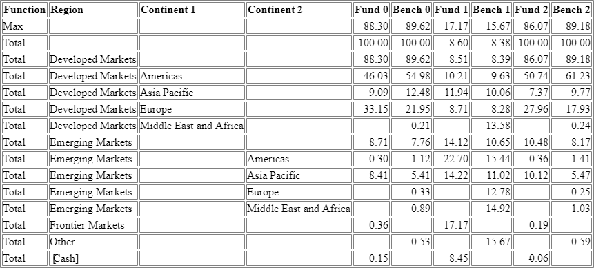

<h6>A <u>s</u>chema for <u>ta</u>bles and <u>ch</u>arts</h6>
This schema defines the format of tabular data, the relationships between columns, rows, headers, and metadata, and the binding of tables to charts.

[Overview](#overview) | [Motivation](#motivation) | [Schema](#schema) | [Table Features](#table-features)

## Overview

Tables can be more complex than a two-dimensional array of data. There are structural relationships that are important for understanding how data is related in order to facilitate human consumption. By retaining this information, it allows users to build these relationships in one application and carry them over to another, without having to redo this work. Once those relationships are defined, they can drive how tables can be bound to charts.

## Motivation

To make FactSet data agnostic by standardizing the format of tabular data and broadly integrating the standard across FactSet's services.

## Schema

### Table Objects

| File | Description | Note |
|------|-------------|------|
| [Package.proto](proto/fds/protobuf/stach/Package.proto) | A package of tables and charts | |
| [MetadataItem.proto](proto/fds/protobuf/stach/MetadataItem.proto) | A metadata item | |
| **Table Messages** | | |
| [Table.proto](proto/fds/protobuf/stach/table/Table.proto) | A table |
| [TableDefinition.proto](proto/fds/protobuf/stach/table/TableDefinition.proto) | The definition of a table |
| [TableData.proto](proto/fds/protobuf/stach/table/TableData.proto) | The data of a table |
| [SeriesDefinition.proto](proto/fds/protobuf/stach/table/SeriesDefinition.proto) | The definition of a series | A series is how a column of data is represented |
| [SeriesData.proto](proto/fds/protobuf/stach/table/SeriesData.proto) | The data of a series | A column of data is stored in a [columnar](https://en.wikipedia.org/wiki/Column-oriented_DBMS) format |
| [SeriesFormat.proto](proto/fds/protobuf/stach/table/SeriesFormat.proto) | The format of a series | Makes tables look human readable |
| [DataType.proto](proto/fds/protobuf/stach/table/DataType.proto) | The type of data in a series | |
| [Wrappers.proto](proto/fds/protobuf/stach/table/Wrappers.proto) | Wrappers around data types | |
| **Metadata Messages** | | |
| [MetadataCollection.proto](proto/fds/protobuf/stach/table/MetadataCollection.proto) | A collection of metadata | All metadata for a table |
| [MetadataLocations.proto](proto/fds/protobuf/stach/table/MetadataLocations.proto) | Where metadata items are located | |
| [ListOfMetadata.proto](proto/fds/protobuf/stach/table/ListOfMetadata.proto) | A list of metadata item ids | |
| [Reference.proto](proto/fds/protobuf/stach/table/Reference.proto) | References a table, column, or row | |

## Table Features

The following sections will walk you through the various features of the table schema and how they work.

> **Note:** All JSON properties are serialized using [camel casing](https://en.wikipedia.org/wiki/Camel_case) even though the protobuf schema uses [snake casing](https://en.wikipedia.org/wiki/Snake_case) due to protobuf's [JSON Mapping](https://developers.google.com/protocol-buffers/docs/proto3#json).

>     Message field names are mapped to lowerCamelCase and become JSON object keys.

### Table

[Figure 1](#figure1) is a simple two-dimensional array of data that you might retrieve from a relational database. It has columns and rows, and all data is denormalized. This is the most basic representation of a table, and is typically what travels through services that process tabular data.

<a name="figure1"></a>
*Figure 1: Table*



### Groups

This same table may also be rendered by grouping columns and/or creating a parent/child relationship between columns. By grouping these columns into one column, like in [Figure 2](#figure2), it reduces the visual complexity of repetitive information and makes it easier to consume for a human.

<a name="figure2"></a>
*Figure 2: Grouped*


In order to make a group, the `SeriesDefinition.next_sibling_id` and/or the `SeriesDefinition.parent_id` property is specified. Using these two properties, a tree of columns can be specified. Columns in the same tree are in the same group.

In order to create a group level, the `SeriesDefinition.parent_id` property is specified. A parent is at a level one higher than its child. For example, the values in the `region` column are one level higher than the values in the `continent1` column and the `continent2` column. The values in the `continent1` and `continent2` column are at the same level because they both have the same parent column.

> **Note:** Any columns can be grouped, as long as all columns in a group are either a dimension or not a dimension.

<a name="figure3"></a>
*Figure 3: Grouped columns with parent/child relationships*

```json
{
    "definition": {
        "columns": [
            {
                "id": "c_function",
                "name": "function",
                "description": "Function",
                "type": "STRING",
                "isDimension": true,
                "nextSiblingId": "c_region"      // In the same group as c_region, c_continent1, and c_continent2
            },
            {
                "id": "c_region",
                "name": "region",
                "description": "Region",
                "type": "STRING",
                "isDimension": true,
                "nextSiblingId": ""              // In the same group as c_function, c_continent1, and c_continent2
            },
            {
                "id": "c_continent1",
                "name": "continent1",
                "description": "Continent 1",
                "type": "STRING",
                "isDimension": true,
                "parentId": "c_region"           // In the same group as c_function, c_region, and c_continent2
            },
            {
                "id": "c_continent2",
                "name": "continent2",
                "description": "Continent 2",
                "type": "STRING",
                "isDimension": true,
                "parentId": "c_region"           // In the same group as c_function, c_region, and c_continent1
            }
        ]
    }
}
```

### Headers

Headers can be added to further describe the columns of data. Headers data is stored in a separate table that is rotated 90 degrees where the rows in the headers table are linked to the columns in the main table by using the `SeriesDefinition.header_id` property.

> **Note:** Headers should only be defined for visible columns. If the `SeriesDefinition.is_hidden` property is set to `true`, then the `SeriesDefinition.header_id` should not be set.

<a name="figure4"></a>
*Figure 4: Table with headers*


<a name="figure5"></a>
*Figure 5: Headers table*


<a name="figure6"></a>
*Figure 6: Headers mapping*


### Dimensions

The first four columns, `function`, `region`, `continent1`, and `continent2`, play a special role. These columns are known as dimensions, specified by the `SeriesDefinition.is_dimension` property, because they describe the data.

Dimensions are not required, however. Simple datasets, like [Figure 1](#figure1), can also be described using this schema without specifying any dimensions, making it flexible enough to accommodate simpler use cases where dimension information is not specified.

<a name="figure7"></a>
*Figure 7: Dimension*

```json
{
    "definition": {
        "columns": [
            {
                "id": "c_continent1",
                "name": "continent1",
                "description": "Continent 1",
                "type": "STRING",
                "isDimension": true,           // A dimenion if true, otherwise not a dimension
                "parentId": "c_region"
            }
        ]
    }
}
```

### Transposing

It is possible to transpose the dimensions in the main table with the headers. [Figure 8](#figure8) demonstrates how the table in [Figure 4](#figure4) would be transposed. Notice that all information is still grouped in the same way. No information was lost. We do see some new column names though, namely `year`, `category`, and `portfolioType`. The `function`, `region`, `continent1`, and `continent2` dimension columns still exist, but they are now columns in the headers table instead of columns in the main table. If you were to transpose this table once more, you would get [Figure 4](#figure4) again.

> **Note:** In order to transpose a table, all non-dimension columns must have the same `DataType` in the `SeriesDefintion.type` property.

<a name="figure8"></a>
*Figure 8: Transposed table*


<a name="figure9"></a>
*Figure 9: Transposed table without headers*


### Compressed Data

When transferring data over the wire, the smaller it is the better, which is why this schema also supports compressing the data. By using the `SeriesData.ranges` property, each item specifies the uncompressed index (as the `key`) and the length (as the `value`) to repeat the data. 

> **Note:** The index is referring to the **uncompressed index** because it requires less memory to compress and decompress.

[Figure 10](#figure10) and [Figure 11](#figure11) illustrate the difference between uncompressed and compressed data.

<a name="figure10"></a>
*Figure 10: Uncompressed data*

```json
"c_continent1": {
    "stringArray": {
        "values": [
            "null",                     // All of these "null" values are unnecessarily repeated
            "null",
            "Americas",
            "Asia Pacific",
            "Europe",
            "Middle East and Africa",
            "null",
            "null",
            "null",
            "null",
            "null",
            "null",
            "null",
            "null"
        ]
    }
}
```

<a name="figure11"></a>
*Figure 11: Compressed data*

```json
"c_continent1": {
    "ranges": {
        { 0, 2 },
        { 6, 7 }
    },
    "stringArray": {
        "values": [
            "null",                     // All of these "null" values are compressed
            "Americas",
            "Asia Pacific",
            "Europe",
            "Middle East and Africa",
            "null"
        ],
    }
}
```

### Format

The `SeriesFormat` message is used to facilitate rendering a human readable table. It is intended as a strong suggestion on how to render the data. By storing this information along with the data, applications can immediately render the table intelligently without having knowledge of the data.

<a name="figure12"></a>
*Figure 12: Formatted column*

```json
{
  "definition": {
    "columns": [
      {
        "id": "c_f0",
        "name": "fund0",
        "description": "Fund 0",
        "type": "DOUBLE",
        "format": {
          "format": "{0:0.00}",
          "nullFormat": "--",
          "halign": "RIGHT"
        }
      }
    ]
  }
}
```

##### Data Format

The `SeriesFormat.format` property is used to render a raw value into a human readable string. Refer to [Formatting Types](https://docs.microsoft.com/en-us/dotnet/standard/base-types/formatting-types) for what strings can be used.

##### Null Format

The `SeriesFormat.null_format` property to is used to render a null value with a special string, like `--` or `@NA`.

##### Null Values

The protobuf schema does not allow null values in a repeated, so in order to denote a null value, a specific value is used. Most values are the max value for that `DataType` unless there is a more appropriate value, like `"NaN"` for doubles and floats.

| Type | Null Value |
|:-----|:-----------|
| double    | "NaN" |
| Duration  | "3652500.00:00:00.9999999" |
| float     | "NaN" |
| int32     | 2147483647 |
| int64     | 9223372036854775807 |
| string    | "null" |
| Timestamp | "12/31/9999 11:59:59 PM" |


##### Alignment

Use the `SeriesFormat.halign` and `SeriesFormat.valign` properties to specify how the data in a series should be aligned within the table cell.

### Metadata

In order for tabular data to mean something, often metadata needs to be attributed to the entire table, or to a particular column, row, or cell. This is useful in providing functionality beyond the raw data. For instance, a URL might be attributed to one of the numbers that links to research notes about that number, or settings might be attributed to one of the columns that documents what engine calculated that data and how that column was calculated.

You can also reference data from another table by using the `MetadataItem.refValue` property, including a whole table, or a specific row or column.

In order to add metadata, you have to

1. Add a `MetadataItem` to the `MetadataCollection.items` property
2. Create a reference to that `MetadataItem` in the `MetadataCollection.locations` property

### Table Metadata

Metadata can be attributed to the entire table by referencing a `MetadataItem` in the `MetadataLocations.table` property.

<a name="figure13"></a>
*Figure 13: Table level metadata*

```json
{
    "data": {
        "metadata": {
            "items": {
                "m_h": {                   // The id of the metadata item
                    "name": "header",
                    "stringValue": "Risk Analysis"
                }
            },
            "locations": {
                "table": [                 // The location is the entire table 
                    "m_h"                  // The id of the metadata item
                ]
            }
        }
    }
}
```

### Column and Row Metadata 

Metadata can be attributed to an entire row by referencing a `MetadataItem` in the `MetadataLocations.rows` property.

Metadata can be attributed to an entire column by referencing a `MetadataItem` in the `MetadataLocations.columns` property.

<a name="figure14"></a>
*Figure 14: Row level metadata*

```json
{
    "data": {
        "metadata": {
            "items": {
                "m_foobar": {              // The id of the metadata item
                    "name": "foobar",
                    "stringValue": "Foo Bar"
                }
            },
            "locations": {
                "rows":  {                 // The location is an entire row,
                                           // (or "columns" to target an entire column)
                    "r_0": {               // The id of the row
                                           // (or column)
                        "ids": [
                            "m_foobar"     // The id of the metadata item
                        ]
                    }
                }
            }
        }
    }
}
```

### Cells Metadata 

Metadata can be attributed to the cells in an entire row by referencing a `MetadataItem` that references another row from the same table in the `MetadataLocations.rows` property. The values correlate by position.

Metadata can be attributed to the cells in an entire column by referencing a `MetadataItem` that references another column from the same table in the `MetadataLocations.columns` property. The values correlate by position.

If you reference a different table, then you must take extra care to make sure that the number of rows or columns equal the number of rows or columns respectively in your table of data, since the values should correlate by position.

<a name="figure15"></a>
*Figure 15: Cells level metadata*

```json
{
    "data": {
        "metadata": {
            "items": {
                "m_regionUrl": {
                    "name": "regionUrl",
                    "refValue": {
                        "tableId": "main",
                        "columnId": "c_regionUrl" // If the reference is a column 
                                                  // or row, it indicates cell level metadata
                    }
                }
            },
            "locations": {
                "columns":  {
                    "c_region": {
                        "ids": [
                            "m_regionUrl"
                        ]
                    }
                }
            }
        }
    }
}
```

### Reference

The `Reference` message allows us to specify a relationship between metadata and data that exists elsewhere, either in this table or another table.

`Reference.table_id` should always be specified.

If `Reference.column_id` is specified, then the data exists in a column, which means that it must match the same number of rows as there are in this table.

If `Reference.row_id` is specified, then the data exists in a row, which means that it must match the same number of columns as there are in this table.

<a name="figure16"></a>
*Figure 16: Reference*

```json
{
    "data": {
        "metadata": {
            "items": {
                "m_regionUrl": {
                    "name": "regionUrl",
                    "refValue": {                 // This object is a Reference
                        "tableId": "main",        // References a table's id
                        "columnId": "c_regionUrl" // References a column's id
                    }
                }
            }
        ]
    }
}
```

### Hidden

Since a column of data can represent metadata, it it likely the case that that data should not be rendered directly, but rather in an interactive way, like a tooltip, or a hyperlink. In this scenario, you can make a column hidden by setting the `SeriesDefinition.is_hidden` property to true.

> **Note:** Do not use this property to indicate that a row is expanded or collapsed. Consider adding a metadata column to indicate that.

<a name="figure17"></a>
*Figure 17: Hidden column*

```json
{
    "definition": {
        "columns": [
            {
                "id": "c_regionUrl",
                "name": "regionUrl",
                "description": "Region Url",
                "type": "STRING",
                "isDimension": true,
                "isHidden": true               // Column will not be rendered because it is hidden
            }
        ]
    }
}
```
