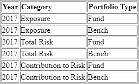

# Column Organized

The goals of the column organized format is to fully describe the complexity of renderable tables and to serialize to the smallest size possible. It is assumed that an SDK will be used to facilitate serialization and utilization of the schema.

## Usage

An API can be designed to return any STACH message, assuming it is well documented. For instance, if your API handles large tables, sorting, and paging of data, it will probably benefit from creating multiple endpoints that return pieces of tables, such as  and . Although  is the top-level message, your API should be designed to be efficent.

Before moving on to digest the documentation, you should familiarize yourself with an example.

### Figure {f#}: Table :figure=figure-table

[filename](examples/ColumnOrganized/EquitiesByRegion/Default.json ':include')

## Package

A package allows the producer to transfer multiple [tables](#table) in one response.

### Figure {f#}: Column Organized Package :figure=figure-package

[filename](figures/ColumnOrganized/Package.json ':include')

### Version

The version is used to validate which version of the STACH schema is expected. It is of the format "{major}.{minor}".

This property is most useful when data is stored persistently. Upon reading the data, the version can be validated against the SDK used to ensure compatibility. For this reason, when persisting STACH data, it is recommended to store a .

## Table

[Figure {f#}](#figure-table) is a simple two-dimensional table of data that you might retrieve from a relational database. It has columns and rows, and all data is denormalized. This is the most basic representation of a table, and is typically what travels through services that process tabular data.

### Figure {f#}: Table :figure=figure-table

## Columns

Columns are defined with a .

Columns are required to have an [id](factset.protobuf.stach.table.ColumnDefinition :ref), since the [columns](factset.protobuf.stach.table.TableData :ref) key refers to the column id.

### Name

The [name](factset.protobuf.stach.table.ColumnDefinition :ref) property can be used to refer to a column outside of the . 

!> This property will also be used to represent the column when stored in a database, so it needs to adhere to the regular expression `[a-zA-Z][a-zA-Z0-9_]*` and be **limited to 63 characters** in order to remain compatible with various database technologies. The database with the most restrictive column name length is [PostgresSQL](https://www.postgresql.org/docs/current/sql-syntax-lexical.html#SQL-SYNTAX-IDENTIFIERS). Wikipedia has a convenient [comparison of databases](https://en.wikipedia.org/wiki/Comparison_of_relational_database_management_systems), too.

### Description

The [description](factset.protobuf.stach.table.ColumnDefinition :ref) is used to render a human friendly header for a column. However, it is not the only way to render a header. Refer to the [headers](#headers) section for more information.

### Format

Refer to the [data format](#data-format) section.

## Rows

Rows are defined with a .

Rows are not required to have an [id](factset.protobuf.stach.table.RowDefinition :ref), however, in certain circumstances it will be required. 

Example where rows are required to have an [id](factset.protobuf.stach.table.RowDefinition :ref):
- Headers table
- Backend services that CRUD rows
- Frontend applications that CRUD rows 

### Format

Refer to the [data format](#data-format) section.

## Dimensions

The first four columns, `function`, `region`, `continent1`, and `continent2`, play a special role. These columns are known as dimensions, specified by the [is_dimension](factset.protobuf.stach.table.ColumnDefinition :ref) property, because they describe the data.

Dimensions are useful for driving functionality, such as:

- [Transposing](#transposing) tables
- Charting tables
  - Binding tables to charts
    - When choosing a dimension for an X axis, the root rows for that column likely be the only rows charted. For example, refer to [Figure {f#}](#figure-table) and note that if the Region column was chosen for an X axis, the 3rd, 8th, 13th, 14th, and 15th rows would likely only be charted.
  - Populating user interfaces to give users good choices to build charts

Dimensions are not required, however. Simple datasets, like [Figure {f#}](#figure-table), can also be described using this schema without specifying any dimensions, making it flexible enough to accommodate simpler use cases where dimension information is not specified, like a file of comma-separated values.

The order of columns is significant and determined by the producer of data. While the most common case is that all of the dimension columns come before the data columns, that is not a requirement. Dimension columns and data columns can be in any order.

> A case where columns may be re-ordered by the user interface is when they are being grouped since the order is determined by the group hierarchy. Refer to the [Groups](#groups-and-the-collapsed-column) section for more information on groups.

### Figure {f#}: Dimension :figure=figure-dimensionColumn

[filename](figures/ColumnOrganized/DimensionColumn.json ':include')

## Groups and the Collapsed Column

Groups are a set of rows that are children to a parent row. A table rendered with groups looks like [Figure {f#}](#figure-collapsedColumn). By creating groups, it reduces the visual complexity of repetitive information and makes it easier to consume for a human. The values are typically indented in a special column called the collapsed column to indicate that one row is a child of another row.

### Figure {f#}: Collapsed Column and Grouped Rows :figure=figure-collapsedColumn

### Collapsed Column Tree

In order to create the collapsed column and the row groups, a collapsed column tree is inferred from the dimension columns. It is illustrated in [Figure {f#}](#figure-collapsedColumnTree).

### Figure {f#}: Collapsed Column Tree :figure=figure-collapsedColumnTree

By iterating the collapsed column tree and analyzing each row's values, we can create row groups. The row groups are another tree, but this time of cell values. A row creates a new group if any non-leaf cell value changes.

> Only dimension columns can participate in the collapsed column tree and thus participate in groups.

### Group Levels

The depth in the collapsed column tree determines the group level. Notice that when the [next_sibling_id](factset.protobuf.stach.table.ColumnDefinition :ref) is used the group level remains the same, and when the [parent_id](factset.protobuf.stach.table.ColumnDefinition :ref) property is used the group level is increased by 1. The group level is typically used to indent the group label. The following figures highlight the different groups after analyzing the values.

### Figure {f#}: Group - Function (Parent Value = null, Level = 0) :figure=figure-tableGroupFunction

### Figure {f#}: Group - Region (Parent Value = null, Level = 0) :figure=figure-tableGroupRegion

### Figure {f#}: Group - Continent 1 (Parent Value = Developed Markets, Level = 1) :figure=figure-tableGroupContinent1

### Figure {f#}: Group - Continent 2 (Parent Value = Emerging Markets, Level = 1) :figure=figure-tableGroupContinent2

An example of this table's columns are represented in [Figure {f#}](#figure-groupedColumnsWithSiblingAndParentChildRelationships).

### Figure {f#}: Grouped columns with sibling and parent/child relationships :figure=figure-groupedColumnsWithSiblingAndParentChildRelationships

[filename](figures/ColumnOrganized/GroupedColumnsWithSiblingAndParentChildRelationships.json ':include')

## Headers

The [description](factset.protobuf.stach.table.ColumnDefinition :ref) is used to display a human readable name when rendering the header for table column. This is available for all dimension and data columns.

However, more complex headers can be added for data columns by adding a separate headers table via the [headers_table_id](factset.protobuf.stach.table.Table :ref). This table is rotated 90 degrees where the rows in the headers table are linked to the columns in the primary table by using the [header_id](factset.protobuf.stach.table.ColumnDefinition :ref) property, which corresponds to a row id in the headers table.

> Headers should only be defined for visible columns. If the [is_hidden](factset.protobuf.stach.table.ColumnDefinition :ref) property is set to `true`, then the [header_id](factset.protobuf.stach.table.ColumnDefinition :ref) should not be set.
>
> The id of a headers table should not appear in the [primary_table_ids](factset.protobuf.stach.Package :ref) property.

### Figure {f#}: Table with headers :figure=figure-tableWithHeaders

### Figure {f#}: Headers table :figure=figure-headersTable

### Figure {f#}: Headers mapping :figure=figure-headersMapping

## Cell Definition

When the  is populated, it overrides the  and the . This allows a column to have mixed data types and formats. The [definitions](factset.protobuf.stach.table.ColumnData :ref) should either be populated with one  for every cell value or empty.

For instance, if some cell values are a string and other cell values are a number, then it will be necessary to override with a cell type by populating the [definitions](factset.protobuf.stach.table.ColumnData :ref) property.

### Figure {f#}: Mixed data types :figure=figure-mixedDataTypes

[filename](figures/ColumnOrganized/MixedDataTypes.json ':include')

## Transposing

It is possible to transpose the dimensions in the primary table with the headers. [Figure {f#}](#figure-transposedTable) demonstrates how the table in [Figure {f#}](#figure-tableWithHeaders) would be transposed. Notice that all information is still grouped in the same way. No information was lost. The data has been rotated 90 degrees. We do see some new column names though, namely `year`, `category`, and `portfolioType`. The `function`, `region`, `continent1`, and `continent2` dimension columns still exist, but they are now columns in the headers table instead of columns in the primary table. If you were to transpose this table once more, you would get [Figure {f#}](#figure-tableWithHeaders) again.

It is assumed that a transpose would only be operated on a table with a small number of columns and rows, therefore the cost of scanning the data to determine if the data types are uniform or not is insignificant.

### Figure {f#}: Transposed table :figure=figure-transposedTable

### Figure {f#}: Transposed table without headers :figure=figure-transposedTableWithoutHeaders

## Compression

When transferring data over the wire, the smaller it is the faster it will transfer, which is why this schema also supports compressing the data. By using the [ranges](factset.protobuf.stach.table.ColumnData :ref) property, each item specifies the uncompressed index (as the `key`) and the length (as the `value`) to repeat the data. 

[Figure {f#}](#figure-uncompressedData) and [Figure {f#}](#figure-compressedData) illustrate the difference between uncompressed and compressed data.

### Figure {f#}: Uncompressed data :figure=figure-uncompressedData

[filename](figures/ColumnOrganized/UncompressedData.json ':include')

### Figure {f#}: Compressed data :figure=figure-compressedData

[filename](figures/ColumnOrganized/CompressedData.json ':include')

## Data Format

The  message is used to facilitate rendering a human readable table. It is intended as a strong suggestion on how to render the data. By storing this information along with the data, applications can immediately render the table intelligently without having knowledge of the data.

There are three places that the  can be applied, and the order of precedence is as follows: , , and .

### Figure {f#}: Formatted column :figure=figure-formattedColumn

[filename](figures/ColumnOrganized/FormattedColumn.json ':include')

### Format

The [format](factset.protobuf.stach.table.DataFormat :ref) property is used to render a raw value into a human readable string. Refer to [Formatting Types](https://docs.microsoft.com/en-us/dotnet/standard/base-types/formatting-types) for what strings can be used.

### Null Format

The [null_format](factset.protobuf.stach.table.DataFormat :ref) property to is used to render a null value with the specified string, like `--`.

### Alignment

Use the [halign](factset.protobuf.stach.table.DataFormat :ref) and [valign](factset.protobuf.stach.table.DataFormat :ref) properties to specify how the data in a series should be aligned within the table cell.

## Metadata

In order for tabular data to mean something, often metadata needs to be attributed to it. Metadata can be attributed to the entire table, to a particular column or row, to column or row cells, or to a specific cell. This is useful in providing functionality beyond the raw data, or explaining how the data was calculated. For instance, a URL might be attributed to one of the numbers that links to research notes about that number, or settings might be attributed to one of the columns that documents what engine calculated that data and how that column was calculated.

There are two sides to metadata,  and .  specifies the thing that you want to attribute metadata to, and  specifies what the metadata is.

In order to add metadata, you have to

1. Add a  to the [items](factset.protobuf.stach.table.MetadataCollection :ref) property.
2. Create a reference to that  in the [locations](factset.protobuf.stach.table.MetadataLocation :ref) property by id.

The following matrix lists the various ways you can add metadata, and also demonstrates that there is a difference between attributing metadata to tables and using tables (or parts of them) as metadata items themselves.

<table>
  <thead>
    <tr>
      <th>&nbsp;</th>
      <th>&nbsp;</th>
      <th colspan="6" style="text-align: center;">Metadata Items</th>
    </tr>
    <tr>
      <th>&nbsp;</th>
      <th>&nbsp;</th>
      <th><a href="#/ColumnOrganized?id=figure-valuemetadataitem">Value</a></th>
      <th><a href="#/ColumnOrganized?id=figure-tablemetadataitem">Table</a></th>
      <th><a href="#/ColumnOrganized?id=figure-columnmetadataitem">Column</a></th>
      <th><a href="#/ColumnOrganized?id=figure-rowmetadataitem">Row</a></th>
      <th><a href="#/ColumnOrganized?id=figure-cellmetadataitemsparsepattern">Cell</a></th>
    </tr>
  </thead>
  <tbody>
    <tr>
      <th rowspan="4" style="font-weight: bold; -webkit-transform: rotate(-90deg);">Metadata Locations</th>
      <th><a href="#/ColumnOrganized?id=figure-tablemetadatalocation" style="font-weight: bold;">Table</a></th>
      <td style="text-align: center;">x</td>
      <td style="text-align: center;">x</td>
      <td style="text-align: center;">x</td>
      <td style="text-align: center;">x</td>
      <td style="text-align: center;">x</td>
    </tr>
    <tr>
      <th><a href="#/ColumnOrganized?id=figure-columnmetadatalocation" style="font-weight: bold;">Column</a></th>
      <td style="text-align: center;">x</td>
      <td style="text-align: center;">x</td>
      <td style="text-align: center;">x</td>
      <td style="text-align: center;">x</td>
      <td style="text-align: center;">x</td>
    </tr>
    <tr>
      <th><a href="#/ColumnOrganized?id=figure-rowmetadatalocation" style="font-weight: bold;">Row</a></th>
      <td style="text-align: center;">x</td>
      <td style="text-align: center;">x</td>
      <td style="text-align: center;">x</td>
      <td style="text-align: center;">x</td>
      <td style="text-align: center;">x</td>
    </tr>
    <tr>
      <th><a href="#/ColumnOrganized?id=figure-cellmetadatalocationsparsepattern" style="font-weight: bold;">Cell</a></th>
      <td style="text-align: center;">x</td>
      <td style="text-align: center;">x</td>
      <td style="text-align: center;">x</td>
      <td style="text-align: center;">x</td>
      <td style="text-align: center;">x</td>
    </tr>
  </tbody>
</table>

### Reference

In order to reference a table (or a part of a table), you must use the  message. It allows us to specify a pointer to metadata that exists in either this table or another table.

[reference_type](factset.protobuf.stach.table.Reference :ref) should always be specified. It should be one of `TABLE`, `COLUMN`, `ROW`, or `CELL`.

If `TABLE` is specified, then [table_id](factset.protobuf.stach.table.Reference :ref) should be the only property specified. Refer to [Figure {f#}](#figure-tableMetadataItem) for an example.

If `COLUMN` is specified, then [table_id](factset.protobuf.stach.table.Reference :ref) and [column_id](factset.protobuf.stach.table.Reference :ref) should be the only properties specified. Refer to [Figure {f#}](#figure-columnMetadataItem) for an example.

If `ROW` is specified, then [table_id](factset.protobuf.stach.table.Reference :ref) and [row_id](factset.protobuf.stach.table.Reference :ref) should be the only properties specified. Refer to [Figure {f#}](#figure-rowMetadataItem) for an example.

If `CELL` is specified, then there are two use cases to consider, the [Dense Pattern](#dense-cell-metadata-item-pattern) and the [Sparse Pattern](#sparse-cell-metadata-item-pattern).

#### Dense Cell Metadata Item Pattern
You must specify [table_id](factset.protobuf.stach.table.Reference :ref) as well as either [column_id](factset.protobuf.stach.table.Reference :ref) or [row_id](factset.protobuf.stach.table.Reference :ref). It implies that the cells in that column or row are to be attributed as metadata items. This also assumes that the  is targeting a column or a row respectively from the same table, since the values correlate by position. You may not use a different table for this pattern since the values correlate by position. Refer to [Figure {f#}](#figure-columnOrientedCellMetadataLocationDensePattern) for a column-oriented example and [Figure {f#}](#figure-rowOrientedCellMetadataLocationDensePattern) for a row-oriented example.

> This pattern should be used when metadata items are dense, as the size of the  is most efficient when most cells in the specified metadata column or row respectively have metadata.

#### Sparse Cell Metadata Item Pattern
You must specify [table_id](factset.protobuf.stach.table.Reference :ref) as well as both [column_id](factset.protobuf.stach.table.Reference :ref) and [row_id](factset.protobuf.stach.table.Reference :ref). It implies that you are attributing a specific singular cell as a metadata item. Refer to [Figure {f#}](#figure-cellMetadataItemSparsePattern) for an example.

This pattern is used when the value already exists in some table in the . In practice, however, this pattern is rarely used, since the value that needs to be attributed is usually independent. When the value is independent, consider using the [Sparse Cell Metadata Location Pattern](#sparse-cell-metadata-location-pattern), instead.

#### Sparse Cell Metadata Location Pattern

To add an independent metadata item to a specific cell, you can attribute a metadata item to a [Cell Metadata Location](#figure-cellMetadataLocationSparsePattern).

> This pattern should only be used when metadata being applied to a column of data is sparse, as the size of the  can be easily overwhelmed with cell metadata.

### Metadata Location

The following are examples of the different possible metadata locations that you can attribute metadata items to.

#### Figure {f#}: Table metadata location :figure=figure-tableMetadataLocation

[filename](figures/ColumnOrganized/TableMetadataLocation.json ':include')

#### Figure {f#}: Column metadata location :figure=figure-columnMetadataLocation

[filename](figures/ColumnOrganized/ColumnMetadataLocation.json ':include')

#### Figure {f#}: Row metadata location :figure=figure-rowMetadataLocation

[filename](figures/ColumnOrganized/RowMetadataLocation.json ':include')

#### Figure {f#}: Cell metadata location (sparse pattern) :figure=figure-cellMetadataLocationSparsePattern

[filename](figures/ColumnOrganized/CellMetadataLocationSparsePattern.json ':include')

#### Figure {f#}: Column-oriented cell metadata location (dense pattern) :figure=figure-columnOrientedCellMetadataLocationDensePattern

[filename](figures/ColumnOrganized/ColumnOrientedCellMetadataLocationDensePattern.json ':include')

#### Figure {f#}: Row-oriented cell metadata location (dense pattern) :figure=figure-rowOrientedCellMetadataLocationDensePattern

[filename](figures/ColumnOrganized/RowOrientedCellMetadataLocationDensePattern.json ':include')

### Metadata Item

The following are examples of the different metadata items that you can attribute to metadata locations.

#### Figure {f#}: Value metadata item :figure=figure-valueMetadataItem

[filename](figures/ColumnOrganized/ValueMetadataItem.json ':include')

#### Figure {f#}: Table reference metadata item :figure=figure-tableMetadataItem

[filename](figures/ColumnOrganized/TableMetadataItem.json ':include')

#### Figure {f#}: Column reference metadata item :figure=figure-columnMetadataItem

[filename](figures/ColumnOrganized/ColumnMetadataItem.json ':include')

#### Figure {f#}: Row reference metadata item :figure=figure-rowMetadataItem

[filename](figures/ColumnOrganized/RowMetadataItem.json ':include')

#### Figure {f#}: Cell reference metadata item (sparse pattern) :figure=figure-cellMetadataItemSparsePattern

[filename](figures/ColumnOrganized/CellMetadataItemSparsePattern.json ':include')

#### Figure {f#}: Column-oriented cell reference metadata item (dense pattern) :figure=figure-columnOrientedCellMetadataLocationDensePattern2

Refer to [Figure {f#}](#figure-columnOrientedCellMetadataLocationDensePattern).

#### Figure {f#}: Row-oriented cell reference metadata item (dense pattern) :figure=figure-rowOrientedCellMetadataLocationDensePattern2

Refer to [Figure {f#}](#figure-rowOrientedCellMetadataLocationDensePattern).

#### Scalar Array Item vs Column or Row Item

Although metadata that exists in the form of a list of values can be expressed with either a scalar array or a column or row item, the difference between the two patterns boils down to a matter of overhead size, compression, and expectations. Consider the following improper use cases.

#### Improper Use Cases

| # | Chosen Item | Assumptions | Recommended Item | Notes |
|---|---|---|---|---|
| 1 | Scalar Array | Correlates in position with the data in a column or row | Column or Row | Positions are only meant to correlate between columns (or rows) in the same table |
| 2 | Scalar Array | Number of items is very large and compression is desired | Column or Row | Column or Row can be compressed |
| 3 | Column or Row | References different table | Scalar Array | Overhead is incurred to define the table |

## Hidden

Since a column of data can represent metadata, it is likely the case that that data should not be rendered directly, but rather in an interactive way, like a tooltip or a hyperlink. In this scenario, you can make a column hidden by setting the [is_hidden](factset.protobuf.stach.table.ColumnDefinition :ref) property to true.

### Figure {f#}: Hidden column :figure=figure-hiddenColumn

[filename](figures/ColumnOrganized/HiddenColumn.json ':include')