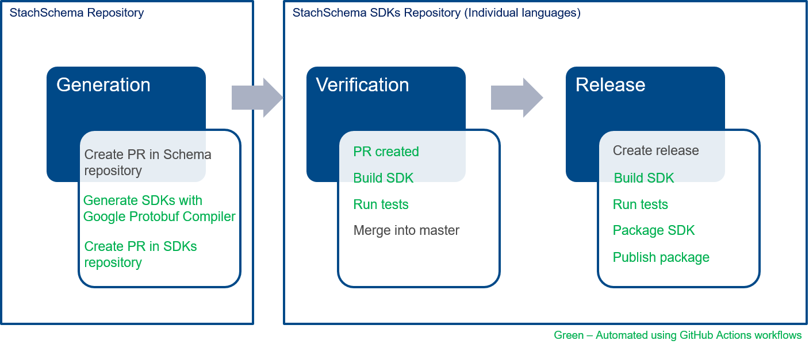

# Development

## Repository structure

1. [Stachschema](https://github.com/factset/stachschema) - STACH Protobuf Schema and its documentation is maintained in this repository.

2. [Stachschema SDKs](https://github.com/factset/stachschema-sdks) - Auto-generated schema’s source code using the Google Protobuf compiler.

## Generate SDKs

### Using GitHub Actions based automation



**Generation:**
* Raise a pull request with required changes to the STACH schema repository. This would trigger a GitHub Actions workflow to raise a pull request on to the StachSchema SDKs repository with corresponsing changes in the SDK source code.  

**Verification:**
* On the SDK's pull request, make sure that all the existing unit tests are successful (GitHub Actions workflow is configured to run the unit tests and the status of the same will be updated on the pull request).
* Increment the SDK package versions and implement new unit tests as required.
* Merge the pull request if everything is good. 

**Release:**
* Create a release tag on StachSchema SDKs repository which should trigger a GitHub Actions workflow to release the SDKs on package managers.

Note: We can release SDKs on NuGet, PyPi and Maven automatically with the GitHub Actions workflow but releasing to the CRAN(R SDK) is a manual process.

### On local machine

**Prerequisites:**
* Install [Docker](https://docs.docker.com/get-docker/) and make sure that it is running.

**Steps:**
* Clone the [StachSchema](https://github.com/factset/stachschema).
* Make the required changes to the [StachSchema](https://github.com/factset/stachschema/tree/master/proto) ProtoBuf schema.
* Raise a PR and merge the protobuf schema changes.
* Clone the [StachSchema SDKs](https://github.com/factset/stachschema-sdks) repository.
* Move into the StachSchema SDKs repository and run the below command.
  - To generate or update all language SDKs.
```
.\Generate.ps1
```
* Increment the SDK versions as required and fix the unit tests in SDKs.
* Raise the pull request with the changes made.

## Build SDKs

* Move into the StachSchema SDKs repository.
  - To build and run unit tests of all language SDKs.
```
.\Build.ps1
```
Above command will build the SDKs' source code, run unit tests and copy the SDKs to an "artifacts" directory.