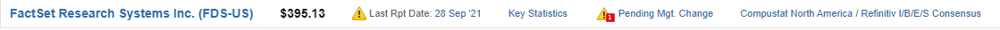
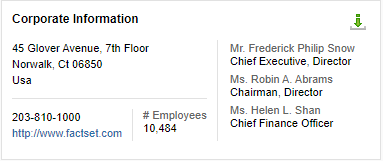

<!--index.md is generated. DO NOT EDIT!-->
<!--
 Search 
 <a name="([a-zA-Z0-9-]+)"
 Replace
 <a class="anchor" href="#/v3/README?id=$1" id="$1"
-->
<!-- include (index.md) -->
# STACH v3

Version 3.0

## Table of Contents

<!-- !toc (level=5 minlevel=2 omit="Table of Contents;FactSet Contextual Data Types") -->

* [Scope](#scope)
* [Conventions](#conventions)
* [Use Cases](#use-cases)
  * [Interactive](#interactive)
  * [Publishing](#publishing)
  * [Streaming](#streaming)
  * [Partial Data](#partial-data)
  * [Analytics](#analytics)
  * [Textual Tabular Data](#textual-tabular-data)
  * [Performance](#performance)
* [Content Negotiation](#content-negotiation)
* [Character Encoding](#character-encoding)
* [Arrow Encoding](#arrow-encoding)
* [JSON Encoding](#json-encoding)
* [Data Types](#data-types)
* [Functionality](#functionality)
  * [Overview](#overview)
  * [Table](#table)
    * [Display Name](#display-name)
    * [Columns](#columns)
    * [Headers](#headers)
    * [Group](#group)
      * [Sort for Grouping](#sort-for-grouping)
      * [Aggregate Rows](#aggregate-rows)
      * [Aggregate Values](#aggregate-values)
      * [Row Relationships](#row-relationships)
      * [Group Level](#group-level)
      * [Group Level Override](#group-level-override)
      * [Collapsed Column](#collapsed-column)
    * [Split](#split)
      * [Split By and Over](#split-by-and-over)
      * [Split Over Headers](#split-over-headers)
      * [Split Columns Alias](#split-columns-alias)
      * [Multi-Level Headers Table](#multi-level-headers-table)
      * [Include Columns in Headers Table](#include-columns-in-headers-table)
      * [Remove Empty Split Columns](#remove-empty-split-columns)
  * [View](#view)
    * [Name](#name)
    * [Display Name](#display-name-1)
  * [Row-Organized](#row-organized)
    * [Header Rows](#header-rows)
* [Custom Metadata](#custom-metadata)
* [SDK Guidance](#sdk-guidance)
* [Integration](#integration)
  * [Perspective](#perspective)
* [Out of Scope](#out-of-scope)
  * [Not A Table](#not-a-table)
* [Examples](#examples)
  * [Example 1: Raw Data](#ex-raw-data)
  * [Example 2: Display Columns](#ex-display-columns)
  * [Example 3: Headers](#ex-headers)
  * [Example 4: Title](#ex-title)
  * [Example 5: Group](#ex-group)
  * [Example 6: Collapsed Column](#ex-collapsed-column)
  * [Example 7: Group Result](#ex-group-result)
  * [Example 8: Collapsed Column Result](#ex-collapsed-column-result)
  * [Example 9: Overriding Group Level](#ex-overriding-group-level)
  * [Example 10: Split](#ex-split)
  * [Example 11: Split Over Single Column](#ex-split-over-single-column)
  * [Example 12: Split Result](#ex-split-result)
  * [Example 13: Split with Additional Columns](#ex-split-with-additional-columns)
  * [Example 14: Empty Split Columns](#ex-empty-split-columns)
  * [Example 15: Multi-Level Headers Table with Group Result](#ex-multi-level-headers-table-with-group-result)
  * [Example 16: Extra Columns](#ex-extra-columns)
  * [Example 17: Table Custom Metadata](#ex-table-custom-metadata)
  * [Example 18: Column Custom Metadata](#ex-column-custom-metadata)
  * [Example 19: Row Custom Metadata](#ex-row-custom-metadata)
  * [Example 20: Cell Custom Metadata](#ex-cell-custom-metadata)
  * [Example 21: Table View Custom Metadata](#ex-table-view-custom-metadata)
  * [Example 22: Row-Organized Table](#ex-row-org-table)
  * [Example 23: Row-Organized Multi-Level Headers Table](#ex-row-org-multi-level-headers-table)
  * [Example 24: Row-Organized Header Rows](#ex-row-org-header-rows)
* [Reference](#reference)
  * [Table](#ref-group-table)
    * [Table](#ref-table)
    * [Table.CollapsedColumnResult](#ref-table-collapsedcolumnresult)
    * [Table.CustomMetadataEntry](#ref-table-custommetadataentry)
    * [Table.GroupResult](#ref-table-groupresult)
    * [Table.SplitResult](#ref-table-splitresult)
  * [Column](#ref-group-column)
    * [Column](#ref-column)
    * [Column.CustomMetadataEntry](#ref-column-custommetadataentry)
  * [Metadata Item](#ref-group-metadata-item)
    * [MetadataItem](#ref-metadataitem)
  * [Views](#ref-group-views)
    * [Views](#ref-views)
    * [Views.View](#ref-views-view)
  * [Table View](#ref-group-table-view)
    * [TableView](#ref-tableview)
    * [TableView.CollapsedColumn](#ref-tableview-collapsedcolumn)
    * [TableView.CustomMetadataEntry](#ref-tableview-custommetadataentry)
    * [TableView.Group](#ref-tableview-group)
    * [TableView.HeadersEntry](#ref-tableview-headersentry)
    * [TableView.Split](#ref-tableview-split)
    * [TableView.Split.HeadersEntry](#ref-tableview-split-headersentry)
  * [Row Organized](#ref-group-row-org)
    * [RowOrganizedTable](#ref-roworganizedtable)
    * [RowOrganizedTable.Column](#ref-roworganizedtable-column)
    * [RowOrganizedTable.Column.CustomMetadataEntry](#ref-roworganizedtable-column-custommetadataentry)
    * [RowOrganizedTable.HeaderCell](#ref-roworganizedtable-headercell)
    * [RowOrganizedTable.HeaderRow](#ref-roworganizedtable-headerrow)
  * [Scalar Types](#ref-group-scalar-types)
* [Roadmap](#roadmap)

<!-- toc! -->

## Scope

The purpose of this document is to standardize how FactSet's Applications and APIs encode tabular data.

## Conventions

The key words “MUST”, “MUST NOT”, “REQUIRED”, “SHALL”, “SHALL NOT”, “SHOULD”, “SHOULD NOT”, “RECOMMENDED”, “MAY”, and “OPTIONAL” in this document are to be interpreted as described in [RFC 2119](https://tools.ietf.org/html/rfc2119).

## Use Cases

It is important to review the following use cases to understand the design of this schema.

### Interactive

Applications can interact with tabular data, allowing users to sort, filter, explore the tabular data by collapsing or expanding rows, and chart the data. 

Applications and services can manipulate data, allowing users to add rows, add columns, change values, and do complex manipulations like joins and pivots.

### Publishing

Applications and services can produce paged documents with a strict width and height, such as PDFs, PowerPoints, and Word documents.

### Streaming

Applications and services can stream time-series tabular data, allowing users to get real-time updates, such as ticker prices, and buy and sell orders.

### Partial Data

Applications can display partial data of a large data set, allowing users to page through the data set efficiently.

### Analytics

Services can perform analytics on tabular data, creating aggregate values that provide insights and trends from historical data.

### Textual Tabular Data

Applications and services in development that transmit textual tabular data in requests and responses is preferrable to software engineers because it increases their productivity.

Applications that expose the tabular data returned from a service directly to the user may require textual tabular data for compatibility reasons or simply prefer textual tabular data to increase the productivity of the user.

### Performance

Applications and services in production prefer performance when transferring data.
## Content Negotiation

Internal transfer of tabular data is **RECOMMENDED** to be encoded in [Apache Arrow](https://arrow.apache.org/docs/format/Columnar.html) over a gRPC [Arrow Flight](https://arrow.apache.org/docs/format/Flight.html) service.

External and internal transfer of tabular data **MAY** be encoded in [Apache Arrow](https://arrow.apache.org/docs/format/Columnar.html) or JSON over an HTTP API endpoint.

Official IANA Media types (MIME types) are registered for Apache Arrow IPC protocol data, both stream and file variants:
- [application/vnd.apache.arrow.stream](https://www.iana.org/assignments/media-types/application/vnd.apache.arrow.stream)
- [application/vnd.apache.arrow.file](https://www.iana.org/assignments/media-types/application/vnd.apache.arrow.file)

The file extension ".arrow" **MUST** be used with the [IPC file format](https://arrow.apache.org/docs/format/Columnar.html#ipc-file-format).

The file extension ".arrows" **MUST** be used with the [IPC streaming format](https://arrow.apache.org/docs/format/Columnar.html#ipc-streaming-format).

> 💡 At the time of publishing this standard, FactSet's gateway does not support gRPC services, therefore it is expected that tabular data is transferred over HTTP APIs. The gateway is expected to support gRPC services by the end of FY21.

## Character Encoding

The character encoding used is UTF-8 without byte order mark and some notable exceptions.
A table **SHALL** only use Unicode code points in the ranges [0x09-0x0a],[0x0d], [0x20-0x7e], [0x85], [0xa0-0xd7ff], [0xe000-0xfffd], and [0x10000-0x10ffff].
This ensures that tables can be encoded in both JSON and Arrow interchangeably.

## Arrow Encoding

A table encoded in the column-organized [Apache Arrow](https://arrow.apache.org/docs/format/Columnar.html) transferred over [Arrow Flight](https://arrow.apache.org/docs/format/Flight.html) is meant for high performance scenarios.

The metadata listed below describes the tabular data.

Metadata keys that start with `fds:stach:` are reserved for this schema and used in the [Arrow custom metadata](https://arrow.apache.org/docs/format/Columnar.html#custom-application-metadata).

The base64 encoded metadata below **MUST** be in accordance with [RFC 4648 section 4](https://datatracker.ietf.org/doc/html/rfc4648#section-4).

Arrow Schema Metadata:

- `fds:stach:version`
  - The version of this schema in `major.minor` format.
    - `major`
      - Increased when removing attributes or adding required attributes.
      - The `minor` is set to zero (`0`) when the `major` is increased.
    - `minor`
      - Increased when adding optional attributes.
  - Required.

- `fds:stach:name`
  - The technical name of the table.
  - Optional.

- `fds:stach:table`
  - The [Table](#table) metadata.
  - [Base64 encoded](https://datatracker.ietf.org/doc/html/rfc4648#section-4) [Protobuf](https://developers.google.com/protocol-buffers/docs/proto3) binary.
  - Required.

- `fds:stach:multiLevelHeadersTable`
  - The Arrow encoded [multi-level headers table](#multi-level-headers-table).
  - [Base64 encoded](https://datatracker.ietf.org/doc/html/rfc4648#section-4) [Arrow](https://arrow.apache.org/docs/format/Columnar.html) binary.
  - Optional.

- `fds:stach:views`
  - The [Views](#views) metadata.
  - [Base64 encoded](https://datatracker.ietf.org/doc/html/rfc4648#section-4) [Protobuf](https://developers.google.com/protocol-buffers/docs/proto3) binary.
  - Optional.

Arrow Field Metadata:

- `name`
  - The name of the column.
  - The column name **MUST** be unique for each column in the table, but should be consistent across systems and repeatable across multiple calls.
  - Native to [Arrow metadata](https://github.com/apache/arrow/blob/master/format/Schema.fbs).
  - Required.

- `nullable`
  - Whether the column can contain NULLs.
  - Native to [Arrow metadata](https://github.com/apache/arrow/blob/master/format/Schema.fbs).
  - Required.

- `type`
  - The [Arrow logical type](https://arrow.apache.org/docs/format/Columnar.html#logical-types) which is derived from the `Column.contextualType`.
  - Native to [Arrow metadata](https://github.com/apache/arrow/blob/master/format/Schema.fbs).
  - Required.

- `fds:stach:column`
  - The [Column](#column) metadata.
  - [Base64 encoded](https://datatracker.ietf.org/doc/html/rfc4648#section-4) [Protobuf](https://developers.google.com/protocol-buffers/docs/proto3) binary.
  - Required.

## JSON Encoding

A table encoded in JSON transferred over HTTP APIs is meant for scenarios where high-performance is not the top priority, such as making development easier for the software engineer and use cases where the encoded data is viewed directly by the user.

Tabular data that is JSON encoded is also row-organized as opposed to Arrow's column-organized data, which makes the tabular data easier to read.

The `RowOrganizedTable` **MUST** be used to encode a table in JSON.

Utilizing [protobuf libraries](https://developers.google.com/protocol-buffers/docs/proto3#json) is strongly **RECOMMENDED** to facilitate serializing to and from JSON.

## Data Types

Tabular data requires types to describe the meaning of the data as well as the way the data is physically represented in memory and in storage.
The data types referred to in this schema are referred to as "contextual data types" because the data type name should imply the contextual meaning of the data. e.g. 'email' instead of 'string; 'id32' instead of 'int32' or 'number'; 'percentage' instead of 'double' or 'number'.
This schema does not define data types, but rather depends on the organization utilizing this schema to define the set of acceptable data types.

Columns **MUST** specify `Column.contextualType` using contextual data type names from the organization's list of approved contextual data types.

Metadata items **MUST** specify `MetadataItem.contextualType` using contextual data type names from the organization's list of approved contextual data types.

It is **NOT RECOMMENDED** to have columns specify a contextual data type that serializes to an object or an array.
SDKs **MAY NOT** support these kinds of data types.

### FactSet Contextual Data Types

> NOTE: This section is here until the API Design Standard includes how FactSet Contextual Data Types should be Arrow-encoded.

The following are the FactSet specific contextual data types and how they are Arrow-encoded.

| Contextual Type | Arrow-encoding ([Schema](https://arrow.apache.org/docs/format/Columnar.html#logical-types)) |
| --- | --- |
| string | Utf8 |
| int32 | Int32 |
| int64 | Int64 |
| real | Double |
| relativeValue | Double |
| datetime | Timestamp |
| date | Date32 (Days since unix epoch) |
| boolean | Bool |
| isin | Utf8 |
| id32 | Int32 |
| id64 | Int64 |
| uid64 | UInt64 |
| bcpLanguage | Utf8 |
| localizedString | Utf8 |
| email | Utf8 |
| url | Utf8 |
| uuid | FixedSizeBinary(16) |
## Functionality

### Overview

`TableView` Metadata:
-   Functionality that has yet to be applied.
-   The consumer is responsible for:
    -   Applying the functionality's algorithm to the data.
    -   Utilizing the information to get the desired rendered result.

`Table` Metadata:
-   Functionality that has been applied.
-   The consumer is responsible for:
    -   Utilizing the information to get the desired rendered result.

In the following table, each row expresses a functionality and which properties are used by that functionality in `TableView` and `Table` respectively.

| Name                | `TableView`             | `Table`                                    |
| ------------------- | ----------------------- | ------------------------------------------ |
| Display Columns     | `columns`               |                                            |
| Headers             | `headers`               |                                            |
| Split               | `split`                 | `splitResult`                              |
| Group               | `group.by`              | `groupResult.by`                           |
| - Aggregate Rows    | `group.by`              | `groupResult.aggregateRows`                |
| - Row Relationships | `group.by`              | `groupResult.rowPath`                      |
| - Group Level       | `group.by`              | `groupResult.rowPath`, `groupResult.level` |
| - Collapsed Column  | `group.collapsedColumn` | `groupResult.collapsedColumnResult`        |

`RowOrganizedTable` Metadata:
-   A row-organized table meant for JSON encoding.
-   Interchangable with Arrow encoding without data loss except when using `RowOrganizedTable.headerRows`.

In the following table, each row expresses a functionality and which properties are used by that functionality in `RowOrganizedTable`.

| Name                | `RowOrganizedTable` |
| ------------------- | --------------------|
| Header Rows         | `headerRows`        |
### Table

The following sections describe how the `Table` metadata and the `TableView` metadata are utilized.
The `Table` metadata describes how the functionality *has* been applied to the data.
The `TableView` metadata describes how the functionality *should* be applied to the data.

#### Display Name

The `TableView.displayName` property **MUST** be used to render the human-readable string representing the table, such as a title above the rendered table or a label in a list.

> 🔎 Refer to [Title](#ex-title) for an example.

#### Columns

The columns to render need to be explicitly enumerated.

> 🔎 Refer to [Display Columns](#ex-display-columns) as an example.

The `TableView.columns` property **MUST** include only the names of columns in the primary table, the collapsed column alias (`TableView.group.collapsedColumn.alias`), or the split columns alias (`TableView.split.alias`).

The order of the `TableView.columns` array **MUST** dictate the order that the columns are rendered.

The table **SHOULD NOT** render any columns if the `TableView.columns` array is empty.

Primary table columns **MAY** be included in `TableView.columns` even when data is grouped and split.
This can provide group level information without being grouped by (creating repetitive rows) or being split over (creating repetitive columns).

> 🔎 Refer to [Extra Columns](#ex-extra-columns) as an example.

#### Headers

The `TableView.headers` property defines the human-readable string used to render a column's header.

> 🔎 Refer to [Headers](#ex-headers) for an example.

The column `name` **SHOULD** be rendered if no header exists for a column.
#### Group

Grouping tabular data implies that rows are grouped by unique values from a list of columns.

> 🔎 Refer to [Group](#ex-group) and [Group Result](#ex-group-result) for an example. You may also review [Perspective Row Pivot](https://perspective.finos.org/docs/md/view.html#row-pivots) for additional understanding of grouping tabular data.

The Group Algorithm accomplishes the following tasks:
1.  Sort the table for grouping. Required
2.  Add aggregate rows to the table. Required.
3.  Add aggregate values to the aggregate rows. Optional.
4.  Specify row relationships. Required.
5.  Specify group level override. Optional.
6.  Add a collapsed column. Optional.


##### Sort for Grouping

The `TableView.group.by` property **MUST** be used to drive which columns to group by.

The `Table.groupResult.by` property **MUST** be used to state which columns *were* grouped by.

The order of `TableView.group.by` is **REQUIRED** to be significant when executing the grouping algorithm.
It instructs the grouping algorithm to sort the table by those columns in that order prior to grouping the rows.

The order of `Table.groupResult.by` is **REQUIRED** to be significant to represent the order of the grouping that was applied.

The `TableView.group.by` property **MUST NOT** be used in conjuction with `Table.groupResult.by`.

##### Aggregate Rows

An aggregate row is a row that is a parent row.

An aggregate row **MAY** include values that aggregate over the values of child rows.

An aggregate row **SHOULD** be added to the table for each unique set of values in the columns that were grouped by.

A `boolean` column represented by `Table.groupResult.aggregateRows` **MUST** be added to the primary table to indicate whether a row in an aggregate row or not.


The `TableView.group.by` property **MUST NOT** be used in conjuction with `Table.groupResult.aggregateRows`.

##### Aggregate Values

Aggregate values are the cell values in aggregate rows in all columns except the columns that were grouped by.

Aggregate values **MAY** be included in aggregate rows.

> 💡 The current schema does not include a way to express what aggregate function should be used or was used to produce an aggregate value.

##### Row Relationships

Row relationships define which rows are parents and children.
They are expressed via a row path, which is a comma-delimited string of primary key values where the first value designates the root row of the tree and the last value designates the parent row.
e.g. "a,d,f".

A `string` column represented by `Table.groupResult.rowPath` **MUST** be added to the primary table that contains the row path values.

The primary key **MUST** consist of a single column when `Table.groupResult.rowPath` is utilized.

The `TableView.group.by` property **MUST NOT** be used in conjuction with `Table.groupResult.rowPath`.

##### Group Level

The group level **MUST** be defined by the number of items in the row path.

The group level **SHOULD** be used to drive the indentation level.

##### Group Level Override

The `Table.groupResult.level` property **SHOULD** override the group level when the number of items in the row path does not accurately reflect the group level.

> 🔎 Refer to [Overriding Group Level](#ex-overriding-group-level) for an example.

The group level override is **NOT RECOMMENDED** because the data is difficult to chart and manipulate (filter, sort, etc).

The `TableView.group.by` property **MUST NOT** be used in conjuction with `Table.groupResult.level`.

##### Collapsed Column

A collapsed column is a single column derived from the values of the columns that were grouped by.
It is considered virtual until it is realized and included in the data set.

> 🔎 Refer to [Collapsed Column](#ex-collapsed-column) and [Collapsed Column Result](#ex-collapsed-column-result) as an example.

The right-most non-null value **SHOULD** be chosen as the value.

The `TableView.group.collapsedColumn` property **MAY** be used with the `Table.groupResult.by` property.
This implies that the columns that were grouped by still exist in the data, and thus the collapsed column is virtual.

It is **RECOMMENDED** to use `TableView.group.collapsedColumn` over `Table.groupResult.collapsedColumnResult` as it keeps data in separate columns which facilitates data manipulation and charting.

The value of the `TableView.group.collapsedColumn.alias` property **SHOULD** be included in the `TableView.columns` property to refer to the virtual collapsed column.

The `TableView.group.collapsedColumn.alias` **MAY** be included in the `TableView.headers` property to refer to the virtual collapsed column.

The `Table.groupResult.collapsedColumnResult.name` property is **REQUIRED** when the collapsed column is realized.

The `Table.groupResult.by` is **REQUIRED** to be empty when the collapsed column is realized.

The `Table.groupResult.collapsedColumnResult.name` property **MUST NOT** be used in a multi-level headers table because it will not be supported by FactSet SDKs.

The `TableView.group.collapsedColumn` property **MUST NOT** be used in conjuction with `Table.groupResult.collapsedColumnResult`.

> 💡 The realized collapsed column is useful when the data is going directly to rendering, which reduces the burden on the consumer.

#### Split

Splitting tabular data by a list of columns implies that the rows are divided by the unique values of the split by columns and replace the columns being split over with new columns.
The values from the split by columns are converted into headers above the new columns.

> 🔎 Refer to [Split](#ex-split) for an example. You may also review [Perspective Column Pivot](https://perspective.finos.org/docs/md/view.html#column-pivots) for additional understanding of splitting tabular data.
>  
> The Split Algorithm accomplishes the following tasks:
> 1.  Add split columns. Required.
> 2.  Remove split over columns. Required.
> 3.  Add a multi-level headers table. Required.

##### Split By and Over

To specify how to split a table:

* The column(s) to split by **MUST** be specified with `TableView.split.by`.
* The column(s) to split over **MUST** be specified with `TableView.split.over`.

As a result of processing the `TableView.split` algorithm:

* A new column **MUST** be created for each unique value in the columns being split by and for each column being split over.
* The column(s) being split by **MUST** be removed from the primary table.
* The column(s) being split over **MUST** be removed from the primary table.
* A [multi-level headers](#multi-level-headers-table) table **MUST** be created and include the column(s) being split by.

| Description | Example | Values |
| ------------------------------------------ | -------------------------------------------------------------------- | ------- |
| If a table's rows are split by `W` columns | `TableView.split.by` = ["date", category"]                           | `W` = 2 |
| with `X` unique values                     | `X` unique values = ["20210101;ele", "20210101;fur", "20210101;off"] | `X` = 3 |
| and `Y` columns are split over             | `TableView.split.over` = ["rev", "pro"]                              | `Y` = 2 |
| then the `W` columns that were split by <br/> and the `Y` columns that were split over <br/> are replaced with `Z` columns | `Z` columns = ["20210101;ele;rev", "20210101;ele;pro", "20210101;fur;rev", <br/> "20210101;fur;pro", "20210101;off;rev", "20210101;off;pro"] | `X` * `Y` = `Z` = 6 |

##### Split Over Headers

For each column in `TableView.split.over`, a header **MAY** be specified in `TableView.split.headers`.
This is similar functionality as `TableView.headers`.

The `TableView.split.headers` **MUST** be added to `TableView.headers` for each new column as a result of the split.

The `TableView.headers` for the columns produced by the split **MAY** be hidden when `TableView.split.over` contains a single column.

> 🔎 Refer to [Split Over Single Column](#ex-split-over-single-column) for an example.

##### Split Columns Alias

The value of the `TableView.split.alias` property **SHOULD** be included in the `TableView.columns` property to refer to all of the columns produced by the split.

##### Multi-Level Headers Table

The multi-level headers table represents the header rows that are produced from the data that was split by.

> 🔎 Refer to [Split Result](#ex-split-result) and [Multi-Level Headers Table with Group Result](#ex-multi-level-headers-table-with-group-result) for an example.

A `string` column **MUST** be added to the multi-level headers table.
The name of this column is your choice but **MUST** be represented by `Table.splitResult.multiLevelHeadersTableReference`.
This facilitates correlating rows in the multi-level headers table to the columns in the primary table.

The column represented by `Table.splitResult.multiLevelHeadersTableReference` **MUST** be populated with the names of the newly created split columns from the primary table.

The `TableView.split.by` **MUST NOT** be used in conjuction with a multi-level headers table.

> 💡 The "multi-level headers table" may be referred to as the "headers table".

##### Include Columns in Headers Table

Additional columns **MAY** be included in the multi-level headers table when splitting by adding their names to the `TableView.split.include` property.
This is useful when metadata columns describe the columns being split by.

> 🔎 Refer to [Split with Additional Columns](#ex-split-with-additional-columns) for an example.

##### Remove Empty Split Columns

Empty split columns **MAY** be removed by setting `TableView.split.removeEmptySplitColumns` to `true`.

> 🔎 Refer to [Empty Split Columns](#ex-empty-split-columns) for an example.

### View

A view provides instructions on how to render tabular data. The schema currently only supports rendering a table as a table, but rendering a table as a chart is in the roadmap.

#### Name

The `View.name` property is a technical name to refer to the view programmatically.

#### Display Name

The `View.displayName` property is a human-readable name to refer to the view in a user interface.

> 🔎 For example, a dropdown might be rendered for the user to allow them to choose amongst the available views, such as "Table", "Bubble Chart", or "Line Chart".

### Row-Organized

The row-organized schema works exactly the same as when a table is encoded in Arrow, except when using header rows since header rows are not supported in Arrow encoding.

> 🔎 Refer to [Row-Organized Table](#ex-row-org-table) and [Row-Organized Multi-Level Headers Table](#ex-row-org-multi-level-headers-table) for an example.

#### Header Rows

Header rows allow for reducing the multi-level headers table to rows of data that include colspans and rowspans.

> 🔎 Refer to [Row-Organized Header Rows](#ex-row-org-header-rows) for an example.

Header rows **MUST** be expressed with the `RowOrganizedTable.headerRows` property.

Colspans and rowspans **MUST** be used exactly like [HTML Table Colspans and Rowspans](https://www.w3schools.com/html/html_table_colspan_rowspan.asp).

The `RowOrganizedTable.multiLevelHeadersTable` property **MUST NOT** be used with the `RowOrganizedTable.headerRows` property.

> ⚠️ The process of converting a multi-level headers table into header rows is not reversible.

## Custom Metadata

Tabular data often needs custom metadata to describe the data in order to understand the data or serve a specific purpose, like rendering links in a web page.

Custom metadata can be added in the following places:

* Table metadata
  * Add a `MetadataItem` to `Table.customMetadata`.
    > 🔎 Refer to [Table Custom Metadata](#ex-table-custom-metadata) as an example.

* Column metadata
  * Add a `MetadataItem` to `Column.customMetadata`.
    > 🔎 Refer to [Column Custom Metadata](#ex-column-custom-metadata) as an example.

* Row metadata 
  * Add a column to the table and describe its relationship in `Table.customMetadata`.
  * Each cell value in the column **MUST** describe the entire row.
    > 🔎 Refer to [Row Custom Metadata](#ex-row-custom-metadata) as an example.

* Cell metadata
  * Add a column to the table and describe its relationship to another column in the other column's `Column.customMetadata`.
  * Each cell value in the column **MUST** describe the cell value of another column in the table.
    > 🔎 Refer to [Cell Custom Metadata](#ex-cell-custom-metadata) as an example.

* TableView metadata
  * Add a `MetadataItem` to `TableView.customMetadata`.
    > 🔎 Refer to [Table View Custom Metadata](#ex-table-view-custom-metadata) as an example.


## SDK Guidance

SDKs **SHOULD** handle parsing tables encoded in both Arrow and JSON.

SDKs **SHOULD** handle parsing all data types in both Arrow and JSON.

SDKs **SHOULD NOT** support row-organized header rows.
- `RowOrganizedTable.headerRows`

SDKs **SHOULD NOT** support a realized collapsed column in a multi-level headers table.
- `Table.groupResult.collapsedColumnResult`

## Integration

### Perspective

A `TableView` can be converted to a [Perspective view](https://perspective.finos.org/docs/md/view.html) using the following mapping:

| Perspective  | TableView    |
| ------------ | ------------ |
| `groupBy`    | `group.by`   |
| `splitBy`    | `split.by`   |
| `columns`    | `split.over` if specified, otherwise `columns` minus any aliases. |
| `aggregates` | TBD          |
| `sort`       | TBD          |
| `filter`     | TBD          |
## Out of Scope

### Not A Table

An info box or header bar can't be rendered with a generic UI control that renders a table. It will require a UI control that specifically renders an "Information Box" or a "Header Bar". Each column is essentially a property and will need to be manually mapped. This kind of data, although it *can* be described with tabular data, is like fitting a round peg into a square hole. It might fit, but it wasn't designed for it.



```
| companyName                   | symbol | price  | companyUrl             | lastRptDate | alert               | databases                                              |
| ----------------------------- |------- | ------ | ---------------------- | ----------- | ------------------- | ------------------------------------------------------ |
| FactSet Research Systems Inc. | FDS-US | 395.13 | http://www.factset.com | 20210928    | Pending Mgmt Change | Compustat North America, Refinitiv, I/B/E/S, Consensus |
```



```
| address                                             | phoneNumber  | url                    | numEmployees | ceo                       | chairman            | cfo               |
| --------------------------------------------------- | ------------ | ---------------------- | ------------ | ------------------------- | ------------------- | ----------------- |
| 45 Glover Avenue, 7th Floor\nNorwalk, Ct 06850\nUSA | 203-810-1000 | http://www.factset.com | 10484        | Mr. Frederick Philip Snow | Ms. Robin A. Abrams | Ms. Helen L. Shan |
```

## Examples

<a class="anchor" href="#/v3/README?id=ex-raw-data" id="ex-raw-data"></a>

### Example 1: Raw Data

A table can contain just raw data without a `TableView` on how to render the table.

Primary Table:

```
| ticker | category        | product  | date     | rev | pro |
| ------ | --------------- | -------- | -------- | --- | --- |
| FOO-US | Electronics     | Computer | 20210101 | 15  | 10  |
| FOO-US | Electronics     | Keyboard | 20210101 | 20  | 15  |
| FOO-US | Furniture       | Couch    | 20210101 | 25  | 20  |
| FOO-US | Office Supplies | Pencil   | 20210101 | 30  | 25  |
| FOO-US | Electronics     | Computer | 20210601 | 35  | 30  |
| FOO-US | Furniture       | Couch    | 20210601 | 40  | 35  |
| FOO-US | Office Supplies | Pencil   | 20210601 | 45  | 40  |
```

`Table` Metadata:

```json
{
    "primaryKeys": [ "ticker", "category", "product", "date" ]
}
```

Rendered:

There is no expectation on rendering, since no `TableView` was defined.

<a class="anchor" href="#/v3/README?id=ex-display-columns" id="ex-display-columns"></a>

### Example 2: Display Columns

A table can be rendered with a subset of columns. Some columns may be metadata and used to drive functionality, like links or tooltips.

Primary Table:

```
| ticker | category        | product  | date     | rev | pro |
| ------ | --------------- | -------- | -------- | --- | --- |
| FOO-US | Electronics     | Computer | 20210101 | 15  | 10  |
| FOO-US | Electronics     | Keyboard | 20210101 | 20  | 15  |
| FOO-US | Furniture       | Couch    | 20210101 | 25  | 20  |
| FOO-US | Office Supplies | Pencil   | 20210101 | 30  | 25  |
| FOO-US | Electronics     | Computer | 20210601 | 35  | 30  |
| FOO-US | Furniture       | Couch    | 20210601 | 40  | 35  |
| FOO-US | Office Supplies | Pencil   | 20210601 | 45  | 40  |
```

`Table` Metadata:

```json
{
    "primaryKeys": [ "ticker", "category", "product", "date" ]
}
```

`TableView` Metadata:

```json
{
    "columns": [  "ticker", "category", "product", "date", "rev" ]
}
```

Rendered:

The `pro` column is NOT displayed.

```
| ticker | category        | product  | date     | rev |
| ------ | --------------- | -------- | -------- | --- |
| FOO-US | Electronics     | Computer | 20210101 | 15  |
| FOO-US | Electronics     | Keyboard | 20210101 | 20  |
| FOO-US | Furniture       | Couch    | 20210101 | 25  |
| FOO-US | Office Supplies | Pencil   | 20210101 | 30  |
| FOO-US | Electronics     | Computer | 20210601 | 35  |
| FOO-US | Furniture       | Couch    | 20210601 | 40  |
| FOO-US | Office Supplies | Pencil   | 20210601 | 45  |
```

<a class="anchor" href="#/v3/README?id=ex-headers" id="ex-headers"></a>

### Example 3: Headers

Column names, due to their technical requirements, are often abbreviated, do not contain spaces, and may have special characters, thus are sometimes inapproriate to render as a header.
Instead, headers can be defined to render a human-readable string.

Primary Table:

```
| ticker | category        | product  | date     | rev | pro |
| ------ | --------------- | -------- | -------- | --- | --- |
| FOO-US | Electronics     | Computer | 20210101 | 15  | 10  |
| FOO-US | Electronics     | Keyboard | 20210101 | 20  | 15  |
| FOO-US | Furniture       | Couch    | 20210101 | 25  | 20  |
| FOO-US | Office Supplies | Pencil   | 20210101 | 30  | 25  |
| FOO-US | Electronics     | Computer | 20210601 | 35  | 30  |
| FOO-US | Furniture       | Couch    | 20210601 | 40  | 35  |
| FOO-US | Office Supplies | Pencil   | 20210601 | 45  | 40  |
```

`Table` Metadata:

```json
{
    "primaryKeys": [ "ticker", "category", "product", "date" ]
}
```

`TableView` Metadata:

```json
{
    "columns": [  "ticker", "category", "product", "date", "rev", "pro" ],
    "headers": {
        "ticker": "Ticker",
        "category": "Category",
        "product": "Product",
        "date": "Date",
        "rev": "Revenue",
        "pro": "Profit"
    }
}
```

Rendered:

```
| Ticker | Category        | Product  | Date     | Revenue | Profit |
| ------ | --------------- | -------- | -------- | ------- | ------ |
| FOO-US | Electronics     | Computer | 20210101 | 15      | 10     |
| FOO-US | Electronics     | Keyboard | 20210101 | 20      | 15     |
| FOO-US | Furniture       | Couch    | 20210101 | 25      | 20     |
| FOO-US | Office Supplies | Pencil   | 20210101 | 30      | 25     |
| FOO-US | Electronics     | Computer | 20210601 | 35      | 30     |
| FOO-US | Furniture       | Couch    | 20210601 | 40      | 35     |
| FOO-US | Office Supplies | Pencil   | 20210601 | 45      | 40     |
```

<a class="anchor" href="#/v3/README?id=ex-title" id="ex-title"></a>

### Example 4: Title

A table can be rendered with a title above the table.

Primary Table:

```
| ticker | category        | product  | date     | rev | pro |
| ------ | --------------- | -------- | -------- | --- | --- |
| FOO-US | Electronics     | Computer | 20210101 | 15  | 10  |
| FOO-US | Electronics     | Keyboard | 20210101 | 20  | 15  |
| FOO-US | Furniture       | Couch    | 20210101 | 25  | 20  |
| FOO-US | Office Supplies | Pencil   | 20210101 | 30  | 25  |
| FOO-US | Electronics     | Computer | 20210601 | 35  | 30  |
| FOO-US | Furniture       | Couch    | 20210601 | 40  | 35  |
| FOO-US | Office Supplies | Pencil   | 20210601 | 45  | 40  |
```

`Table` Metadata:

```json
{
    "primaryKeys": [ "ticker", "category", "product", "date" ]
}
```

`TableView` Metadata:

```json
{
    "displayName": "Sales",
    "columns": [  "ticker", "category", "product", "date", "rev", "pro" ],
    "headers": {
        "ticker": "Ticker",
        "category": "Category",
        "product": "Product",
        "date": "Date",
        "rev": "Revenue",
        "pro": "Profit"
    }
}
```

Rendered:

```
Sales

| Ticker | Category        | Product  | Date     | Revenue | Profit |
| ------ | --------------- | -------- | -------- | ------- | ------ |
| FOO-US | Electronics     | Computer | 20210101 | 15      | 10     |
| FOO-US | Electronics     | Keyboard | 20210101 | 20      | 15     |
| FOO-US | Furniture       | Couch    | 20210101 | 25      | 20     |
| FOO-US | Office Supplies | Pencil   | 20210101 | 30      | 25     |
| FOO-US | Electronics     | Computer | 20210601 | 35      | 30     |
| FOO-US | Furniture       | Couch    | 20210601 | 40      | 35     |
| FOO-US | Office Supplies | Pencil   | 20210601 | 45      | 40     |
```

<a class="anchor" href="#/v3/README?id=ex-group" id="ex-group"></a>

### Example 5: Group

A table with aggregate rows and row relationships make the table easier for the user to explore by collapsing rows.

Primary Table:

```
| ticker | category        | product  | date     | rev | pro |
| ------ | --------------- | -------- | -------- | --- | --- |
| FOO-US | Electronics     | Computer | 20210101 | 15  | 10  |
| FOO-US | Electronics     | Keyboard | 20210101 | 20  | 15  |
| FOO-US | Furniture       | Couch    | 20210101 | 25  | 20  |
| FOO-US | Office Supplies | Pencil   | 20210101 | 30  | 25  |
| FOO-US | Electronics     | Computer | 20210601 | 35  | 30  |
| FOO-US | Furniture       | Couch    | 20210601 | 40  | 35  |
| FOO-US | Office Supplies | Pencil   | 20210601 | 45  | 40  |
```

`Table` Metadata:

```json
{
    "primaryKeys": [ "ticker", "category", "product", "date" ]
}
```

`TableView` Metadata:

```json
{
    "columns": [  "ticker", "date", "category", "product", "rev", "pro" ],
    "headers": {
        "ticker": "Ticker",
        "date": "Date",
        "category": "Category",
        "product": "Product",
        "rev": "Revenue",
        "pro": "Profit"
    },
    "group": {
        "by": [ "ticker", "date", "category", "product" ]
    }
}
```

Rendered:

```
| Ticker | Date     | Category        | Product  | Revenue | Profit |
| ------ | -------- | --------------- | -------- | ------- | ------ |
| FOO-US |          |                 |          |         |        |
| FOO-US | 20210101 |                 |          |         |        |
| FOO-US | 20210101 | Electronics     |          |         |        |
| FOO-US | 20210101 | Electronics     | Computer | 15      | 10     |
| FOO-US | 20210101 | Electronics     | Keyboard | 20      | 15     |
| FOO-US | 20210101 | Furniture       |          |         |        |
| FOO-US | 20210101 | Furniture       | Couch    | 25      | 20     |
| FOO-US | 20210101 | Office Supplies |          |         |        |
| FOO-US | 20210101 | Office Supplies | Pencil   | 30      | 25     |
| FOO-US | 20210601 |                 |          |         |        |
| FOO-US | 20210601 | Electronics     |          |         |        |
| FOO-US | 20210601 | Electronics     | Computer | 35      | 30     |
| FOO-US | 20210601 | Furniture       |          |         |        |
| FOO-US | 20210601 | Furniture       | Couch    | 40      | 35     |
| FOO-US | 20210601 | Office Supplies |          |         |        |
| FOO-US | 20210601 | Office Supplies | Pencil   | 45      | 40     |
```

<a class="anchor" href="#/v3/README?id=ex-collapsed-column" id="ex-collapsed-column"></a>

### Example 6: Collapsed Column

A table is more human-readable when the columns that were grouped by are also collapsed into a single column with indentation based on the group level of the row.

Primary Table:

```
| ticker | category        | product  | date     | rev | pro |
| ------ | --------------- | -------- | -------- | --- | --- |
| FOO-US | Electronics     | Computer | 20210101 | 15  | 10  |
| FOO-US | Electronics     | Keyboard | 20210101 | 20  | 15  |
| FOO-US | Furniture       | Couch    | 20210101 | 25  | 20  |
| FOO-US | Office Supplies | Pencil   | 20210101 | 30  | 25  |
| FOO-US | Electronics     | Computer | 20210601 | 35  | 30  |
| FOO-US | Furniture       | Couch    | 20210601 | 40  | 35  |
| FOO-US | Office Supplies | Pencil   | 20210601 | 45  | 40  |
```

`Table` Metadata:

```json
{
    "primaryKeys": [ "ticker", "category", "product", "date" ]
}
```

`TableView` Metadata:

```json
{
    "columns": [  "$collapsedColumn", "rev", "pro" ],
    "headers": {
        "$collapsedColumn": "Sales",
        "rev": "Revenue",
        "pro": "Profit"
    },
    "group": {
        "by": [ "ticker", "date", "category", "product" ],
        "collapsedColumn": {
            "alias": "$collapsedColumn"
        }
    }
}
```

Rendered:

```
| Sales               | Revenue | Profit |
| ------------------- | ------- | ------ |
| FOO-US              |         |        |
|   20210101          |         |        |
|     Electronics     |         |        |
|       Computer      | 15      | 10     |
|       Keyboard      | 20      | 15     |
|     Furniture       |         |        |
|       Couch         | 25      | 20     |
|     Office Supplies |         |        |
|       Pencil        | 30      | 25     |
|   20210601          |         |        |
|     Electronics     |         |        |
|       Computer      | 35      | 30     |
|     Furniture       |         |        |
|       Couch         | 40      | 35     |
|     Office Supplies |         |        |
|       Pencil        | 45      | 40     |
```

<a class="anchor" href="#/v3/README?id=ex-group-result" id="ex-group-result"></a>

### Example 7: Group Result

Tabular data that is already grouped can be represented in this schema.

Primary Table:

```
| pk | ticker | date     | category        | product  | rev | pro | rowPath | aggr  |
| -- | ------ | -------- | --------------- | -------- | --- | --- | ------- | ----- |
| a  | FOO-US |          |                 |          |     |     |         | true  |
| b  | FOO-US | 20210101 |                 |          |     |     | a       | true  |
| c  | FOO-US | 20210101 | Electronics     |          |     |     | a,b     | true  |
| d  | FOO-US | 20210101 | Electronics     | Computer | 15  | 10  | a,b,c   | false |
| e  | FOO-US | 20210101 | Electronics     | Keyboard | 20  | 15  | a,b,c   | false |
| f  | FOO-US | 20210101 | Furniture       |          |     |     | a,b     | true  |
| g  | FOO-US | 20210101 | Furniture       | Couch    | 25  | 20  | a,b,f   | false |
| h  | FOO-US | 20210101 | Office Supplies |          |     |     | a,b     | true  |
| i  | FOO-US | 20210101 | Office Supplies | Pencil   | 30  | 25  | a,b,h   | false |
| j  | FOO-US | 20210601 |                 |          |     |     | a       | true  |
| k  | FOO-US | 20210601 | Electronics     |          |     |     | a,j     | true  |
| l  | FOO-US | 20210601 | Electronics     | Computer | 35  | 30  | a,j,k   | false |
| m  | FOO-US | 20210601 | Furniture       |          |     |     | a,j     | true  |
| n  | FOO-US | 20210601 | Furniture       | Couch    | 40  | 35  | a,j,m   | false |
| o  | FOO-US | 20210601 | Office Supplies |          |     |     | a,j     | true  |
| p  | FOO-US | 20210601 | Office Supplies | Pencil   | 45  | 40  | a,j,o   | false |
```

`Table` Metadata:

```json
{
    "primaryKeys": [ "pk" ],
    "groupResult": {
        "by": [ "ticker", "date", "category", "product" ],
        "rowPath": "rowPath",
        "aggregateRows": "aggr"
    }
}
```

`TableView` Metadata:

```json
{
    "columns": [  "$collapsedColumn", "rev", "pro" ],
    "headers": {
        "$collapsedColumn": "Sales",
        "rev": "Revenue",
        "pro": "Profit"
    },
    "group": {
        "collapsedColumn": {
            "alias": "$collapsedColumn"
        }
    }
}
```

Rendered:

```
| Sales               | Revenue | Profit |
| ------------------- | ------- | ------ |
| FOO-US              |         |        |
|   20210101          |         |        |
|     Electronics     |         |        |
|       Computer      | 15      | 10     |
|       Keyboard      | 20      | 15     |
|     Furniture       |         |        |
|       Couch         | 25      | 20     |
|     Office Supplies |         |        |
|       Pencil        | 30      | 25     |
|   20210601          |         |        |
|     Electronics     |         |        |
|       Computer      | 35      | 30     |
|     Furniture       |         |        |
|       Couch         | 40      | 35     |
|     Office Supplies |         |        |
|       Pencil        | 45      | 40     |
```

<a class="anchor" href="#/v3/README?id=ex-collapsed-column-result" id="ex-collapsed-column-result"></a>

### Example 8: Collapsed Column Result

It is possible to reduce the columns that were grouped by into a single column in the primary table called the "collapsed column". When the column is included in the data set, it is called a "realized collapsed column".

Primary Table:

```
| pk | sales           | rev | pro | rowPath | aggr  |
| -- | --------------- | --- | --- | ------- | ----- |
| a  | FOO-US          |     |     |         | true  |
| b  | 20210101        |     |     | a       | true  |
| c  | Electronics     |     |     | a,b     | true  |
| d  | Computer        | 15  | 10  | a,b,c   | false |
| e  | Keyboard        | 20  | 15  | a,b,c   | false |
| f  | Furniture       |     |     | a,b     | true  |
| g  | Couch           | 25  | 20  | a,b,f   | false |
| h  | Office Supplies |     |     | a,b     | true  |
| i  | Pencil          | 30  | 25  | a,b,h   | false |
| j  | 20210601        |     |     | a       | true  |
| k  | Electronics     |     |     | a,j     | true  |
| l  | Computer        | 35  | 30  | a,j,k   | false |
| m  | Furniture       |     |     | a,j     | true  |
| n  | Couch           | 40  | 35  | a,j,m   | false |
| o  | Office Supplies |     |     | a,j     | true  |
| p  | Pencil          | 45  | 40  | a,j,p   | false |
```

`Table` Metadata:

```json
{
    "primaryKeys": [ "pk" ],
    "groupResult": {
        "rowPath": "rowPath",
        "aggregateRows": "aggr",
        "collapsedColumnResult": {
            "name": "sales"
        }
    }
}
```

`TableView` Metadata:

```json
{
    "columns": [  "sales", "rev", "pro" ],
    "headers": {
        "sales": "Sales",
        "rev": "Revenue",
        "pro": "Profit"
    }
}
```

Rendered:

```
| Sales               | Revenue | Profit |
| ------------------- | ------- | ------ |
| FOO-US              |         |        |
|   20210101          |         |        |
|     Electronics     |         |        |
|       Computer      | 15      | 10     |
|       Keyboard      | 20      | 15     |
|     Furniture       |         |        |
|       Couch         | 25      | 20     |
|     Office Supplies |         |        |
|       Pencil        | 30      | 25     |
|   20210601          |         |        |
|     Electronics     |         |        |
|       Computer      | 35      | 30     |
|     Furniture       |         |        |
|       Couch         | 40      | 35     |
|     Office Supplies |         |        |
|       Pencil        | 45      | 40     |
```

<a class="anchor" href="#/v3/README?id=ex-overriding-group-level" id="ex-overriding-group-level"></a>

### Example 9: Overriding Group Level

If the data source includes aggregate rows but some aggregate rows are missing, it creates gaps in group levels, and thus the length of the row path is not consistent with the data hierarchy. This is otherwise known as "jagged rows".

Primary Table:

```
| pk | ticker | date     | category        | product  | rev | pro | rowPath | aggr  | level |
| -- | ------ | -------- | --------------- | -------- | --- | --- | ------- | ----- | ----- |
| a  | FOO-US |          |                 |          |     |     |         | true  |       |
| b  | FOO-US | 20210101 |                 |          |     |     | a       | true  |       |
| c  | FOO-US | 20210101 | Electronics     |          |     |     | a,b     | true  |       |
| d  | FOO-US | 20210101 | Electronics     | Computer | 15  | 10  | a,b,c   | false |       |
| e  | FOO-US | 20210101 | Electronics     | Keyboard | 20  | 15  | a,b,c   | false |       |
| f  | FOO-US | 20210101 | Furniture       |          |     |     | a,b     | true  |       |
| g  | FOO-US | 20210101 | Furniture       | Couch    | 25  | 20  | a,b,f   | false |       |
| h  | FOO-US | 20210101 | Office Supplies |          |     |     | a,b     | true  |       |
| i  | FOO-US | 20210101 | Office Supplies | Pencil   | 30  | 25  | a,b,h   | false |       |
| j  | FOO-US | 20210601 |                 |          |     |     | a       | true  |       |
| k  | FOO-US | 20210601 |                 | Computer | 35  | 30  | a,j     | false | 3     |
| l  | FOO-US | 20210601 |                 | Couch    | 40  | 35  | a,j     | false | 3     |
| m  | FOO-US | 20210601 |                 | Pencil   | 45  | 40  | a,j     | false | 3     |
```

`Table` Metadata:

```json
{
    "primaryKeys": [ "pk" ],
    "groupResult": {
        "by": [ "ticker", "date", "category", "product" ],
        "rowPath": "rowPath",
        "aggregateRows": "aggr",
        "level": "level"
    }
}
```

`TableView` Metadata:

```json
{
    "columns": [  "$collapsedColumn", "rev", "pro" ],
    "headers": {
        "rev": "Revenue",
        "pro": "Profit"
    },
    "group": {
        "collapsedColumn": {
            "alias": "$collapsedColumn"
        }
    }
}
```

Rendered:

```
|                     | Revenue | Profit |
| ------------------- | ------- | ------ |
| FOO-US              |         |        |
|   20210101          |         |        |
|     Electronics     |         |        |
|       Computer      | 15      | 10     |
|       Keyboard      | 20      | 15     |
|     Furniture       |         |        |
|       Couch         | 25      | 20     |
|     Office Supplies |         |        |
|       Pencil        | 30      | 25     |
|   20210601          |         |        |
|       Computer      | 35      | 30     |
|       Couch         | 40      | 35     |
|       Pencil        | 45      | 40     |
```

<a class="anchor" href="#/v3/README?id=ex-split" id="ex-split"></a>

### Example 10: Split

Tabular data can be more human readable when it is split vertically and spread horizontally over a set of columns.

Primary Table:

```
| ticker | category        | product  | date     | rev | pro |
| ------ | --------------- | -------- | -------- | --- | --- |
| FOO-US | Electronics     | Computer | 20210101 | 15  | 10  |
| FOO-US | Electronics     | Keyboard | 20210101 | 20  | 15  |
| FOO-US | Furniture       | Couch    | 20210101 | 25  | 20  |
| FOO-US | Office Supplies | Pencil   | 20210101 | 30  | 25  |
| FOO-US | Electronics     | Computer | 20210601 | 35  | 30  |
| FOO-US | Furniture       | Couch    | 20210601 | 40  | 35  |
| FOO-US | Office Supplies | Pencil   | 20210601 | 45  | 40  |
```

`Table` Metadata:

```json
{
    "primaryKeys": [ "ticker", "category", "product", "date" ]
}
```

`TableView` Metadata:

```json
{
    "columns": [  "ticker", "category", "product", "$splitColumns" ],
    "headers": {
        "ticker": "Ticker",
        "category": "Category",
        "product": "Product"
    },
    "split": {
        "alias": "$splitColumns",
        "by": [ "date" ],
        "over": [ "rev", "pro" ],
        "headers": {
            "rev": "Revenue",
            "pro": "Profit"
        },
    }
}
```

Rendered:

```
|        |                 |          |      20210101    |      20210601    |
| Ticker | Category        | Product  | Revenue | Profit | Revenue | Profit |
| ------ | --------------- | -------- | ------- | ------ | ------- | ------ |
| FOO-US | Electronics     | Computer | 15      | 10     | 35      | 30     |
| FOO-US | Electronics     | Keyboard | 20      | 15     |         |        |
| FOO-US | Furniture       | Couch    | 25      | 20     | 40      | 35     |
| FOO-US | Office Supplies | Pencil   | 30      | 25     | 45      | 40     |
```

<a class="anchor" href="#/v3/README?id=ex-split-over-single-column" id="ex-split-over-single-column"></a>

### Example 11: Split Over Single Column

When data is split over a single column, it creates a repetitive headers row, which can be hidden if desired.

For instance, when rendering a PDF, it would likely be desired to not render the repetitive headers row. However, in an application with interactive controls, there may be a need to have that repetitive row because there may need to be buttons to interact with that column, like sorting or filtering.

Primary Table:

```
| ticker | date     | category        | product  | rev |
| ------ | -------- | --------------- | -------- | --- |
| FOO-US | 20210101 | Electronics     | Computer | 15  |
| FOO-US | 20210101 | Electronics     | Keyboard | 20  |
| FOO-US | 20210101 | Furniture       | Couch    | 25  |
| FOO-US | 20210101 | Office Supplies | Pencil   | 30  |
| FOO-US | 20210601 | Electronics     | Computer | 35  |
| FOO-US | 20210601 | Furniture       | Couch    | 40  |
| FOO-US | 20210601 | Office Supplies | Pencil   | 45  |
```

`Table` Metadata:

```json
{
    "primaryKeys": [ "ticker", "category", "product" ]
}
```

`TableView` Metadata:

```json
{
    "columns": [ "$collapsedColumn", "$splitColumns" ],
    "group": {
        "by": [ "ticker", "category", "product" ],
        "collapsedColumn": {
            "alias": "$collapsedColumn"
        }
    },
    "split": {
        "alias": "$splitColumns",
        "by": [ "date" ],
        "over": [ "rev" ]
    }
}
```

Rendered with the repetitive `rev` header:

```
|                   | 20210101 | 20210601 |
|                   | rev      | rev      |
| ----------------- | -------- | -------- |
| FOO-US            |          |          |
|   Electronics     |          |          |
|     Computer      | 15       | 35       |
|     Keyboard      | 20       |          |
|   Furniture       |          |          |
|     Couch         | 25       | 40       |
|   Office Supplies |          |          |
|     Pencil        | 30       | 45       |
```

Rendered without the repetitive `rev` header:

```
|                   | 20210101 | 20210601 |
| ----------------- | -------- | -------- |
| FOO-US            |          |          |
|   Electronics     |          |          |
|     Computer      | 15       | 35       |
|     Keyboard      | 20       |          |
|   Furniture       |          |          |
|     Couch         | 25       | 40       |
|   Office Supplies |          |          |
|     Pencil        | 30       | 45       |
```

<a class="anchor" href="#/v3/README?id=ex-split-result" id="ex-split-result"></a>

### Example 12: Split Result

The split algorithm produces multiple levels of headers based on the data that was split on, which are referred to as the "multi-level headers". They are expressed as another table that we refer to as the "multi-Level headers table".

The multi-level headers table does not include the headers of the columns that were split over. e.g. `rev` and `pro` have headers `Revenue` and `Profit` which are not included in the multi-level headers table.

Primary Table:

```
| ticker | category        | product  | rev;20210101 | pro;20210101 | rev;20210601 | pro;20210601 |
| ------ | --------------- | -------- | ------------ | ------------ | ------------ | ------------ |
| FOO-US | Electronics     | Computer | 15           | 10           | 35           | 30           |
| FOO-US | Electronics     | Keyboard | 20           | 15           |              |              |
| FOO-US | Furniture       | Couch    | 25           | 20           | 40           | 35           |
| FOO-US | Office Supplies | Pencil   | 30           | 25           | 45           | 40           |
```

`Table` Metadata:

```json
{
    "primaryKeys": [ "ticker", "category", "product" ],
    "splitResult": {
        "multiLevelHeadersTableReference": "xxx"
    }
}
```

`TableView` Metadata:

```json
{
    "columns": [  "$collapsedColumn", "rev;20210101", "pro;20210101", "rev;20210601", "pro;20210601" ],
    "headers": {
        "rev;20210101": "Revenue",
        "pro;20210101": "Profit",
        "rev;20210601": "Revenue",
        "pro;20210601": "Profit"
    },
    "group": {
        "by": [ "ticker", "category", "product" ],
        "collapsedColumn": {
            "alias": "$collapsedColumn"
        }
    }
}
```

Headers Table:

The order of the columns in this table are insignifcant, as the order is driven by the columns in the primary table, however, they have been organized so that you can visualize the headers by rotating this table 90 degrees counter-clockwise.

```
| xxx          | date     |
| -------------| -------- |
| rev;20210101 | 20210101 |
| pro;20210101 | 20210101 |
| rev;20210601 | 20210601 |
| pro;20210601 | 20210601 |
```

Headers `Table` Metadata:

```json
{
    "primaryKeys": [ "xxx" ]
}
```

Headers `TableView` Metadata:

```json
{
    "columns": [ "$collapsedColumn" ],
    "group": {
        "by": [ "date", "xxx" ],
        "collapsedColumn": {
            "alias": "$collapsedColumn"
        }
    }
}
```

Rendered:

```
|                   |      20210101    |      20210101    |
|                   | Revenue | Profit | Revenue | Profit |
| ----------------- | ------- | ------ | ------- | ------ |
| FOO-US            |         |        |         |        |
|   Electronics     |         |        |         |        |
|     Computer      | 15      | 10     | 35      | 30     |
|     Keyboard      | 20      | 15     |         |        |
|   Furniture       |         |        |         |        |
|     Couch         | 25      | 20     | 40      | 35     |
|   Office Supplies |         |        |         |        |
|     Pencil        | 30      | 25     | 45      | 40     |
```

<a class="anchor" href="#/v3/README?id=ex-split-with-additional-columns" id="ex-split-with-additional-columns"></a>

### Example 13: Split with Additional Columns

When metadata columns are associated with the columns to split by, it is usually necessary to include those additional metadata columns in the multi-level headers table.

The `categoryUrl` column is a metadata column for the `category` column. Since the table is splitting by the `category` column, it is necessary to include the `categoryUrl` column in the multi-level headers table.

Primary Table:

```
| ticker | category        | categoryUrl | product  | date     | rev | pro |
| ------ | --------------- | ----------- | -------- | -------- | --- | --- |
| FOO-US | Electronics     | http://...  | Computer | 20210101 | 15  | 10  |
| FOO-US | Electronics     | http://...  | Keyboard | 20210101 | 20  | 15  |
| FOO-US | Furniture       | http://...  | Couch    | 20210101 | 25  | 20  |
| FOO-US | Office Supplies | http://...  | Pencil   | 20210101 | 30  | 25  |
| FOO-US | Electronics     | http://...  | Computer | 20210601 | 35  | 30  |
| FOO-US | Furniture       | http://...  | Couch    | 20210601 | 40  | 35  |
| FOO-US | Office Supplies | http://...  | Pencil   | 20210601 | 45  | 40  |
```

`Table` Metadata:

```json
{
    "primaryKeys": [ "ticker", "category", "product", "date" ]
}
```

`TableView` Metadata:

```json
{
    "columns": [  "ticker", "product", "date", "$splitColumns" ],
    "headers": {
        "ticker": "Ticker",
        "product": "Product",
        "date": "Date"
    },
    "split": {
        "alias": "$splitColumns",
        "by": [ "category" ],
        "include": [ "categoryUrl" ],
        "over": [ "rev", "pro" ],
        "headers": {
            "rev": "Revenue",
            "pro": "Profit"
        },
    }
}
```

Primary Table Result:

```
| ticker | product  | date     | rev;ele | pro;ele | rev;fur | pro;fur | rev;off | pro;off |
| ------ | -------- | -------- |-------- | ------- | ------- | ------- | ------- | ------- |
| FOO-US | Computer | 20210101 | 15      | 10      |         |         |         |         |
| FOO-US | Keyboard | 20210101 | 20      | 15      |         |         |         |         |
| FOO-US | Couch    | 20210101 |         |         | 25      | 20      |         |         |
| FOO-US | Pencil   | 20210101 |         |         |         |         | 30      | 25      |
| FOO-US | Computer | 20210601 | 35      | 30      |         |         |         |         |
| FOO-US | Couch    | 20210601 |         |         | 40      | 35      |         |         |
| FOO-US | Pencil   | 20210601 |         |         |         |         | 45      | 40      |
```

`Table` Metadata:

```json
{
    "primaryKeys": [ "ticker", "product", "date" ],
    "splitResult": {
        "multiLevelHeadersTableReference": "xxx"
    }
}
```

`TableView` Metadata:

```json
{
    "columns": [  "ticker", "product", "date", "rev;ele", "pro;ele", "rev;fur", "pro;for", "rev;off", "pro;off" ],
    "headers": {
        "ticker": "Ticker",
        "product": "Product",
        "date": "Date",
        "rev;ele": "Revenue",
        "pro;ele": "Profit",
        "rev;fur": "Revenue",
        "pro;fur": "Profit",
        "rev;off": "Revenue",
        "pro;off": "Profit"
    }
}
```

Headers Table Result:

The multi-level headers table also contains the category url column because it was included in the split.

```
| xxx     | category        | categoryUrl |
| ------- | --------------- | ----------- |
| rev;ele | Electronics     | http://...  |
| pro;ele | Electronics     | http://...  |
| rev;fur | Furniture       | http://...  |
| pro;fur | Furniture       | http://...  |
| rev;off | Office Supplies | http://...  |
| pro;off | Office Supplies | http://...  |
```

Headers `Table` Metadata:

```json
{
    "primaryKeys": [ "xxx" ]
}
```

Headers `TableView` Metadata:

```json
{
    "columns": [ "$collapsedColumn" ],
    "group": {
        "by": [ "category", "xxx" ],
        "collapsedColumn": {
            "alias": "$collapsedColumn"
        }
    }
}
```

Rendered:

The category headers row would be rendered with links using the values from the `categoryUrl` column.

```
|        |          |          |    Electronics   |     Furniture    | Office Supplies  |
| Ticker | Product  | Date     | Revenue | Profit | Revenue | Profit | Revenue | Profit |
| ------ | -------- | -------- | ------- | ------ | ------- | ------ | ------- | ------ |
| FOO-US | Computer | 20210101 | 15      | 10     |         |        |         |        |
| FOO-US | Keyboard | 20210101 | 20      | 15     |         |        |         |        |
| FOO-US | Couch    | 20210101 |         |        | 25      | 20     |         |        |
| FOO-US | Pencil   | 20210101 |         |        |         |        | 30      | 25     |
| FOO-US | Computer | 20210601 | 35      | 30     |         |        |         |        |
| FOO-US | Couch    | 20210601 |         |        | 40      | 35     |         |        |
| FOO-US | Pencil   | 20210601 |         |        |         |        | 45      | 40     |
```

<a class="anchor" href="#/v3/README?id=ex-empty-split-columns" id="ex-empty-split-columns"></a>

### Example 14: Empty Split Columns

When tabular data is split resulting in some split columns that are empty, the human-readability of the table can be improved by removing the empty split columns.

Primary Table:

```
| ticker | category     | price | EBIT | EBITDA | EV_EBIT | EV_EBITDA |
| ------ | ------------ | ----- | ---- |------- | ------- | --------- |
| FOO-US | Market Data  | 5     |      |        |         |           | 
| BAR-US | Market Data  | 10    |      |        |         |           |
| FOO-US | Financial    |       | 5000 | 5500   |         |           | 
| BAR-US | Financial    |       | 200  | 250    |         |           |
| FOO-US | Valuation    |       |      |        | 15      | 5         | 
| BAR-US | Valuation    |       |      |        | 20      | 10        |
```

`Table` Metadata:

```json
{
    "primaryKeys": [ "ticker", "category" ]
}
```

`TableView` Metadata:

```json
{
    "columns": [  "ticker", "category" ],
    "headers": {
        "ticker": "Ticker",
        "category": "Category"
    },
    "split": {
        "alias": "$splitColumns",
        "by": [ "category" ],
        "over": [ "price", "EBIT", "EBITDA", "EV_EBIT", "EV_EBITDA" ],
        "headers": {
            "price": "Price",
            "EBIT": "EBIT",
            "EBITDA": "EBITDA",
            "EV_EBIT": "EV/EBIT",
            "EV_EBITDA": "EV/EBITDA"
        },
        "removeEmptySplitColumns": true
    }
}
```

Split Result Primary Table:

*Before split columns removed*

```
| ticker | m;price | m;EBIT | m;EBITDA | m;EV_EBIT | m;EV_EBITDA | f;price | f;EBIT | f;EBITDA | f;EV_EBIT | f;EV_EBITDA | v;price | v;EBIT | v;EBITDA | v;EV_EBIT | v;EV_EBITDA |
| ------ | ------- | ------ |--------- | --------- | ----------- | ------- | ------ |--------- | --------- | ----------- | ------- | ------ |--------- | --------- | ----------- |
| FOO-US | 5       |        |          |           |             |         | 5000   | 5500     |           |             |         |        |          | 15        | 5           |
| BAR-US | 10      |        |          |           |             |         | 200    | 250      |           |             |         |        |          | 20        | 10          |
```

*After empty split columns removed*

```
| ticker | m;price | f;EBIT | f;EBITDA | v;EV_EBIT | v;EV_EBITDA |
| ------ | ------- | ------ |--------- | --------- | ----------- |
| FOO-US | 5       | 5000   | 5500     | 15        | 5           |
| BAR-US | 10      | 200    | 250      | 20        | 10          |
```

Rendered:

```
|        | Market Data | Financial     | Valuation           |
| Ticker | Price       | EBIT | EBITDA | EV/EBIT | EV/EBITDA |
| ------ | ----------- | ---- |------- | ------- | --------- |
| FOO-US | 5           | 5000 | 5500   | 15      | 5         | 
| BAR-US | 10          | 200  | 250    | 20      | 10        |
```

<a class="anchor" href="#/v3/README?id=ex-multi-level-headers-table-with-group-result" id="ex-multi-level-headers-table-with-group-result"></a>

### Example 15: Multi-Level Headers Table with Group Result

The grouping algorithm can be applied to the multi-level headers table exactly the same way it is applied to the primary table.

Primary Table:

```
| pk | ticker | category        | product  | rev;20210101 | pro;20210101 | rev;20210601 | pro;20210601 | rowPath | aggr  |
| -- | ------ | --------------- | -------- | ------------ | ------------ | ------------ | ------------ | ------- | ----- |
| a  | FOO-US |                 |          |              |              |              |              |         | true  |
| b  | FOO-US | Electronics     |          |              |              |              |              | a       | true  |
| c  | FOO-US | Electronics     | Computer | 15           | 10           | 35           | 30           | a,b     | false |
| d  | FOO-US | Electronics     | Keyboard | 20           | 15           |              |              | a,b     | false |
| e  | FOO-US | Furniture       |          |              |              |              |              | a       | true  |
| f  | FOO-US | Furniture       | Couch    | 25           | 20           | 40           | 35           | a,e     | false |
| g  | FOO-US | Office Supplies |          |              |              |              |              | a       | true  |
| h  | FOO-US | Office Supplies | Pencil   | 30           | 25           | 45           | 40           | a,g     | false |
```

`Table` Metadata:

```json
{
    "primaryKeys": [ "pk" ],
    "groupResult": {
        "by": [ "ticker", "category", "product" ],
        "rowPath": "rowPath",
        "aggregateRows": "aggr"
    },
    "splitResult": {
        "multiLevelHeadersTableReference": "xxx"
    }
}
```

`TableView` Metadata:

```json
{
    "columns": [  "$collapsedColumn", "rev;20210101", "pro;20210101", "rev;20210601", "pro;20210601" ],
    "headers": {
        "rev;20210101": "Revenue",
        "pro;20210101": "Profit",
        "rev;20210601": "Revenue",
        "pro;20210601": "Profit"
    },
    "group": {
        "collapsedColumn": {
            "alias": "$collapsedColumn"
        }
    }
}
```

Headers Table:

```
| pk | xxx          | date     | rowPath | aggr  |
| -- | ------------ | -------- | ------- | ----- |
| a  |              | 20210101 |         | true  |
| b  | rev;20210101 | 20210101 | a       | false |
| c  | pro;20210101 | 20210101 | a       | false |
| d  |              | 20210601 |         | true  |
| e  | rev;20210601 | 20210601 | d       | false |
| f  | pro;20210601 | 20210601 | d       | false |
```

Headers `Table` Metadata:

```json
{
    "primaryKeys": [ "pk" ],
    "groupResult": {
        "by": [ "date", "xxx" ],
        "rowPath": "rowPath",
        "aggregateRows": "aggr"
    }
}
```

Headers `TableView` Metadata:

```json
{
    "columns": [ "$collapsedColumn" ],
    "group": {
        "collapsedColumn": {
            "alias": "$collapsedColumn"
        }
    }
}
```

Rendered:

```
|                   |      20210101    |      20210601    |
|                   | Revenue | Profit | Revenue | Profit |
| ----------------- | ------- | ------ | ------- | ------ |
| FOO-US            |         |        |         |        |
|   Electronics     |         |        |         |        |
|     Computer      | 15      | 10     | 35      | 30     |
|     Keyboard      | 20      | 15     |         |        |
|   Furniture       |         |        |         |        |
|     Couch         | 25      | 20     | 40      | 35     |
|   Office Supplies |         |        |         |        |
|     Pencil        | 30      | 25     | 45      | 40     |
```

<a class="anchor" href="#/v3/README?id=ex-extra-columns" id="ex-extra-columns"></a>

### Example 16: Extra Columns

When data is grouped and split, additional columns can provide group level information without being grouped by (creating repetitive rows) or being split over (creating repetitive columns).

Review how the `productId` column is rendered outside of the collapsed column and the columns produced by the split.

Primary Table:

```
| ticker | date     | category        | productId | product  | rev | pro |
| ------ | -------- | --------------- | --------- | -------- | --- | --- |
| FOO-US | 20210101 | Electronics     | P001      | Computer | 15  | 10  |
| FOO-US | 20210101 | Electronics     | P002      | Keyboard | 20  | 15  |
| FOO-US | 20210101 | Furniture       | P003      | Couch    | 25  | 20  |
| FOO-US | 20210101 | Office Supplies | P004      | Pencil   | 30  | 25  |
| FOO-US | 20210601 | Electronics     | P001      | Computer | 35  | 30  |
| FOO-US | 20210601 | Furniture       | P003      | Couch    | 40  | 35  |
| FOO-US | 20210601 | Office Supplies | P004      | Pencil   | 45  | 40  |
```

`Table` Metadata:

```json
{
    "primaryKeys": [ "ticker", "category", "product", "date" ]
}
```

`TableView` Metadata:

```json
{
    "columns": [  "productId", "$collapsedColumn", "$splitColumns" ],
    "headers": {
        "productId": "Product Id",
        "$collapsedColumn": "Sales"
    },
    "group": {
        "by": [ "ticker", "category", "product" ],
        "collapsedColumn": {
            "alias": "$collapsedColumn"
        }
    },
    "split": {
        "alias": "$splitColumns",
        "by": [ "date" ],
        "over": [ "rev", "pro" ],
        "headers": {
            "rev": "Revenue",
            "pro": "Profit"
        },
    }
}
```

Rendered:

```
|            |                   |      20210101    |      20210601    |
| Product Id | Sales             | Revenue | Profit | Revenue | Profit |
| ---------- | ----------------- | ------- | ------ | ------- | ------ |
|            | FOO-US            |         |        |         |        |
|            |   Electronics     |         |        |         |        |
| P001       |     Computer      | 15      | 10     | 35      | 30     |
| P002       |     Keyboard      | 20      | 15     |         |        |
|            |   Furniture       |         |        |         |        |
| P003       |     Couch         | 25      | 20     | 40      | 35     |
|            |   Office Supplies |         |        |         |        |
| P004       |     Pencil        | 30      | 25     | 45      | 40     |
```

<a class="anchor" href="#/v3/README?id=ex-table-custom-metadata" id="ex-table-custom-metadata"></a>

### Example 17: Table Custom Metadata

Table level custom metadata can be used to describe an entire table.

e.g. Titles, footers, how it was calculated, or identifiers.

Primary Table:

```
| ticker | category        | product  | date     | rev | pro |
| ------ | --------------- | -------- | -------- | --- | --- |
| FOO-US | Electronics     | Computer | 20210101 | 15  | 10  |
| FOO-US | Electronics     | Keyboard | 20210101 | 20  | 15  |
| FOO-US | Furniture       | Couch    | 20210101 | 25  | 20  |
| FOO-US | Office Supplies | Pencil   | 20210101 | 30  | 25  |
| FOO-US | Electronics     | Computer | 20210601 | 35  | 30  |
| FOO-US | Furniture       | Couch    | 20210601 | 40  | 35  |
| FOO-US | Office Supplies | Pencil   | 20210601 | 45  | 40  |
```

`Table` Metadata:

```json
{
    "primaryKeys": [ "ticker", "category", "product", "date" ],
    "customMetadata": {
        "calculationId": {
            "contextualType": "uuid",
            "value": "8e653532-e65f-4e3c-b4bc-c7f506f43478"
        }
    }
}
```

<a class="anchor" href="#/v3/README?id=ex-column-custom-metadata" id="ex-column-custom-metadata"></a>

### Example 18: Column Custom Metadata

Column level custom metadata can be used to describe an entire column.

e.g. How it was calculated, or how it is sorted.

Primary Table:

```
| ticker | category        | product  | date     | rev | pro |
| ------ | --------------- | -------- | -------- | --- | --- |
| FOO-US | Electronics     | Computer | 20210101 | 15  | 10  |
| FOO-US | Electronics     | Keyboard | 20210101 | 20  | 15  |
| FOO-US | Furniture       | Couch    | 20210101 | 25  | 20  |
| FOO-US | Office Supplies | Pencil   | 20210101 | 30  | 25  |
| FOO-US | Electronics     | Computer | 20210601 | 35  | 30  |
| FOO-US | Furniture       | Couch    | 20210601 | 40  | 35  |
| FOO-US | Office Supplies | Pencil   | 20210601 | 45  | 40  |
```

`Column` Metadata:

This column metadata is applied to the 'date' column.

```json
{
    "contextualType": "date",
    "customMetadata": {
        "columnFilter": {
            "contextualType": "dateRange",
            "value": {
                "start": "2016-01-01",
                "end": null
            }
        }
    }
}
```

<a class="anchor" href="#/v3/README?id=ex-row-custom-metadata" id="ex-row-custom-metadata"></a>

### Example 19: Row Custom Metadata

Row level custom metadata can be used to describe an entire row.

e.g. Whether it has been collapsed or not.

Primary Table:

```
| pk | ticker | date     | category        | product  | rev | pro | rowPath | aggr  | collapsed |
| -- | ------ | -------- | --------------- | -------- | --- | --- | ------- | ----- | --------- |
| a  | FOO-US |          |                 |          |     |     |         | true  | false     |
| b  | FOO-US | 20210101 |                 |          |     |     | a       | true  | false     |
| c  | FOO-US | 20210101 | Electronics     |          |     |     | a,b     | true  | false     |
| d  | FOO-US | 20210101 | Electronics     | Computer | 15  | 10  | a,b,c   | false | false     |
| e  | FOO-US | 20210101 | Electronics     | Keyboard | 20  | 15  | a,b,c   | false | false     |
| f  | FOO-US | 20210101 | Furniture       |          |     |     | a,b     | true  | true      |
| g  | FOO-US | 20210101 | Furniture       | Couch    | 25  | 20  | a,b,f   | false | false     |
| h  | FOO-US | 20210101 | Office Supplies |          |     |     | a,b     | true  | true      |
| i  | FOO-US | 20210101 | Office Supplies | Pencil   | 30  | 25  | a,b,h   | false | false     |
| j  | FOO-US | 20210601 |                 |          |     |     | a       | true  | false     |
| k  | FOO-US | 20210601 | Electronics     |          |     |     | a,j     | true  | false     |
| l  | FOO-US | 20210601 | Electronics     | Computer | 35  | 30  | a,j,k   | false | false     |
| m  | FOO-US | 20210601 | Furniture       |          |     |     | a,j     | true  | true      |
| n  | FOO-US | 20210601 | Furniture       | Couch    | 40  | 35  | a,j,m   | false | false     |
| o  | FOO-US | 20210601 | Office Supplies |          |     |     | a,j     | true  | true      |
| p  | FOO-US | 20210601 | Office Supplies | Pencil   | 45  | 40  | a,j,o   | false | false     |
```

`Table` Metadata:

```json
{
    "primaryKeys": [ "ticker", "category", "product", "date" ],
    "customMetadata": {
        "collapsedRowColumnName": {
            "contextualType": "string",
            "value": "collapsed"
        }
    }
}
```

<a class="anchor" href="#/v3/README?id=ex-cell-custom-metadata" id="ex-cell-custom-metadata"></a>

### Example 20: Cell Custom Metadata

Cell level custom metadata can be used to describe each cell in another column.

e.g. A url for a company, or a phone number for an employee.

Primary Table:

```
| ticker | category        | product  | date     | rev | pro | companyUrl |
| ------ | --------------- | -------- | -------- | --- | --- | ---------- |
| FOO-US | Electronics     | Computer | 20210101 | 15  | 10  | http://... |
| FOO-US | Electronics     | Keyboard | 20210101 | 20  | 15  | http://... |
| FOO-US | Furniture       | Couch    | 20210101 | 25  | 20  | http://... |
| FOO-US | Office Supplies | Pencil   | 20210101 | 30  | 25  | http://... |
| FOO-US | Electronics     | Computer | 20210601 | 35  | 30  | http://... |
| FOO-US | Furniture       | Couch    | 20210601 | 40  | 35  | http://... |
| FOO-US | Office Supplies | Pencil   | 20210601 | 45  | 40  | http://... |
```

`Column` Metadata:

This column metadata is applied to the 'ticker' column.

```json
{
    "contextualType": "string",
    "customMetadata": {
        "linkColumnName": {
            "contextualType": "string",
            "value": "companyUrl"
        }
    }
}
```

<a class="anchor" href="#/v3/README?id=ex-table-view-custom-metadata" id="ex-table-view-custom-metadata"></a>

### Example 21: Table View Custom Metadata

Table view custom metadata can be used to describe additional cues for renderings.

e.g. Cell alignment, format strings, or style classes.

Primary Table:

```
| ticker | category        | product  | date     | rev | pro |
| ------ | --------------- | -------- | -------- | --- | --- |
| FOO-US | Electronics     | Computer | 20210101 | 15  | 10  |
| FOO-US | Electronics     | Keyboard | 20210101 | 20  | 15  |
| FOO-US | Furniture       | Couch    | 20210101 | 25  | 20  |
| FOO-US | Office Supplies | Pencil   | 20210101 | 30  | 25  |
| FOO-US | Electronics     | Computer | 20210601 | 35  | 30  |
| FOO-US | Furniture       | Couch    | 20210601 | 40  | 35  |
| FOO-US | Office Supplies | Pencil   | 20210601 | 45  | 40  |
```

`Table` Metadata:

```json
{
    "primaryKeys": [ "ticker", "category", "product", "date" ],
}
```

`TableView` Metadata:

```json
{
    "columns": [  "ticker", "date", "category", "product", "rev", "pro" ],
    "customMetadata": {
        "columnHorizontalAlignment": {
            "contextualType": "object",
            "value": {
                "ticker": "LEFT",
                "category": "LEFT",
                "product": "LEFT",
                "date": "LEFT",
                "rev": "RIGHT",
                "pro": "RIGHT"
            }
        }
    }
}
```

Rendered:

```
| Ticker | Date     | Category        | Product  | Revenue | Profit |
| ------ | -------- | --------------- | -------- | ------- | ------ |
| FOO-US |          |                 |          |         |        |
| FOO-US | 20210101 |                 |          |         |        |
| FOO-US | 20210101 | Electronics     |          |         |        |
| FOO-US | 20210101 | Electronics     | Computer |      15 |     10 |
| FOO-US | 20210101 | Electronics     | Keyboard |      20 |     15 |
| FOO-US | 20210101 | Furniture       |          |         |        |
| FOO-US | 20210101 | Furniture       | Couch    |      25 |     20 |
| FOO-US | 20210101 | Office Supplies |          |         |        |
| FOO-US | 20210101 | Office Supplies | Pencil   |      30 |     25 |
| FOO-US | 20210601 |                 |          |         |        |
| FOO-US | 20210601 | Electronics     |          |         |        |
| FOO-US | 20210601 | Electronics     | Computer |      35 |     30 |
| FOO-US | 20210601 | Furniture       |          |         |        |
| FOO-US | 20210601 | Furniture       | Couch    |      40 |     35 |
| FOO-US | 20210601 | Office Supplies |          |         |        |
| FOO-US | 20210601 | Office Supplies | Pencil   |      45 |     40 |
```

<a class="anchor" href="#/v3/README?id=ex-row-org-table" id="ex-row-org-table"></a>

### Example 22: Row-Organized Table

The following is a simple table represented in the row-organized schema.

Primary Table:

```
| ticker | category        | product  | date     | revenue | profit |
| ------ | --------------- | -------- | -------- | ------- | ------ |
| FOO-US | Electronics     | Computer | 20210101 | 15      | 10     |
| FOO-US | Electronics     | Keyboard | 20210101 | 20      | 15     |
| FOO-US | Furniture       | Couch    | 20210101 | 25      | 20     |
| FOO-US | Office Supplies | Pencil   | 20210101 | 30      | 25     |
| FOO-US | Electronics     | Computer | 20210601 | 35      | 30     |
| FOO-US | Furniture       | Couch    | 20210601 | 40      | 35     |
| FOO-US | Office Supplies | Pencil   | 20210601 | 45      | 45     |
```

Rendered:

```
| Ticker | Category        | Product  | Date     | Revenue | Profit |
| ------ | --------------- | -------- | -------- | ------- | ------ |
| FOO-US | Electronics     | Computer | 20210101 | 15      | 10     |
| FOO-US | Electronics     | Keyboard | 20210101 | 20      | 15     |
| FOO-US | Furniture       | Couch    | 20210101 | 25      | 20     |
| FOO-US | Office Supplies | Pencil   | 20210101 | 30      | 25     |
| FOO-US | Electronics     | Computer | 20210601 | 35      | 30     |
| FOO-US | Furniture       | Couch    | 20210601 | 40      | 35     |
| FOO-US | Office Supplies | Pencil   | 20210601 | 45      | 40     |
```

JSON:

```json
{
    "version": "3.0",
    "columns": [
        {
            "name": "ticker",
            "contextualType": "string"
        },
        {
            "name": "category",
            "contextualType": "string"
        },
        {
            "name": "product",
            "contextualType": "string"
        },
        {
            "name": "date",
            "contextualType": "date"
        },
        {
            "name": "revenue",
            "contextualType": "int32"
        },
        {
            "name": "profit",
            "contextualType": "int32"
        }
    ],
    "table": {
        "primaryKeys": [ "ticker", "category", "product", "date" ]
    },
    "views": [
        {
            "name": "myRenderedTable",
            "tableView": {
                "columns": [  "ticker", "category", "product", "date", "revenue" ],
                "headers": {
                    "ticker": "Ticker",
                    "category": "Category",
                    "product": "Product",
                    "date": "Date",
                    "revenue": "Revenue",
                    "profit": "Profit"
                }
            }
        }
    ],
    "rows": [
        {
            "ticker": "FOO-US",
            "category": "Electronics",
            "product": "Computer",
            "date": "20210101",
            "revenue": 15,
            "profit": 10
        },
        {
            "ticker": "FOO-US",
            "category": "Electronics",
            "product": "Keyboard",
            "date": "20210101",
            "revenue": 20,
            "profit": 15
        },
        {
            "ticker": "FOO-US",
            "category": "Furniture",
            "product": "Couch",
            "date": "20210101",
            "revenue": 25,
            "profit": 20
        },
        {
            "ticker": "FOO-US",
            "category": "Office Supplies",
            "product": "Pencil",
            "date": "20210101",
            "revenue": 30,
            "profit": 25
        },
        {
            "ticker": "FOO-US",
            "category": "Electronics",
            "product": "Computer",
            "date": "20210601",
            "revenue": 35,
            "profit": 30
        },
        {
            "ticker": "FOO-US",
            "category": "Furniture",
            "product": "Couch",
            "date": "20210601",
            "revenue": 40,
            "profit": 35
        },
        {
            "ticker": "FOO-US",
            "category": "Office Supplies",
            "product": "Pencil",
            "date": "20210601",
            "revenue": 45,
            "profit": 40
        }
    ]
}
```

<a class="anchor" href="#/v3/README?id=ex-row-org-multi-level-headers-table" id="ex-row-org-multi-level-headers-table"></a>

### Example 23: Row-Organized Multi-Level Headers Table

Multi-level headers tables can be represented via the `RowOrganizedTable.multiLevelHeadersTable` property. It is populated with a `RowOrganizedTable`.

Primary Table:

```
| ticker | category        | product  | rev;20210101 | pro;20210101 | rev;20210601 | pro;20210601 |
| ------ | --------------- | -------- | ------------ | ------------ | ------------ | ------------ |
| FOO-US | Electronics     | Computer | 15           | 10           | 35           | 30           |
| FOO-US | Electronics     | Keyboard | 20           | 15           |              |              |
| FOO-US | Furniture       | Couch    | 25           | 20           | 40           | 35           |
| FOO-US | Office Supplies | Pencil   | 30           | 25           | 45           | 40           |
```

Headers Table:

```
| xxx          | date     |
| ------------ | -------- |
| rev;20210101 | 20210101 |
| pro;20210101 | 20210101 |
| rev;20210601 | 20210601 |
| pro;20210601 | 20210601 |
```

Rendered:

```
|                   |      20210101    |      20210601    |
| Sales             | Revenue | Profit | Revenue | Profit |
| ----------------- | ------- | ------ | ------- | ------ |
| FOO-US            |         |        |         |        |
|   Electronics     |         |        |         |        |
|     Computer      | 15      | 10     | 35      | 30     |
|     Keyboard      | 20      | 15     |         |        |
|   Furniture       |         |        |         |        |
|     Couch         | 25      | 20     | 40      | 35     |
|   Office Supplies |         |        |         |        |
|     Pencil        | 30      | 25     | 45      | 40     |
```

JSON:

```json
{
    "version": "3.0",
    "columns": [
        {
            "name": "ticker",
            "contextualType": "string"
        },
        {
            "name": "category",
            "contextualType": "string"
        },
        {
            "name": "product",
            "contextualType": "string"
        },
        {
            "name": "rev;20210101",
            "contextualType": "int32"
        },
        {
            "name": "pro;20210101",
            "contextualType": "int32"
        },
        {
            "name": "rev;20210601",
            "contextualType": "int32"
        },
        {
            "name": "pro;20210601",
            "contextualType": "int32"
        }
    ],
    "table": {
        "primaryKeys": [ "pk" ],
        "splitResult": {
            "multiLevelHeadersTableReference": "xxx"
        }
    },
    "multiLevelHeadersTable": {
        "columns": [
            {
                "name": "xxx",
                "contextualType": "string"
            },
            {
                "name": "date",
                "contextualType": "string"
            }
        ],
        "table": {
            "primaryKeys": [ "xxx" ]
        },
        "views": [
            {
                "name": "myRenderedHeadersTable",
                "tableView": {
                    "columns": [ "$collapsedColumn" ],
                    "group": {
                        "by": [ "date", "xxx" ],
                        "collapsedColumn": {
                            "alias": "$collapsedColumn"
                        }
                    }
                }
            }
        ]
    },
    "views": [
        {
            "name": "myRenderedTable",
            "tableView": {
                "columns": [  "$collapsedColumn", "rev;20210101", "pro;20210101", "rev;20210601", "pro;20210601" ],
                "headers": {
                    "$collapsedColumn": "Sales"
                },
                "group": {
                    "by": [ "ticker", "category", "product" ],
                    "collapsedColumn": {
                        "alias": "$collapsedColumn"
                    }
                }
            }
        }
    ],
    "rows": [
        {
            "ticker": "FOO-US",
            "category": "Electronics",
            "product": "Computer",
            "rev;20210101": 15,
            "pro;20210101": 10,
            "rev;20210601": 35,
            "pro;20210601": 30
        },
        {
            "ticker": "FOO-US",
            "category": "Electronics",
            "product": "Keyboard",
            "rev;20210101": 20,
            "pro;20210101": 15
        },
        {
            "ticker": "FOO-US",
            "category": "Furniture",
            "product": "Couch",
            "rev;20210101": 25,
            "pro;20210101": 20,
            "rev;20210601": 40,
            "pro;20210601": 35
        },
        {
            "ticker": "FOO-US",
            "category": "Office Supplies",
            "product": "Pencil",
            "rev;20210101": 30,
            "pro;20210101": 25,
            "rev;20210601": 45,
            "pro;20210601": 40
        }
    ]
}
```

<a class="anchor" href="#/v3/README?id=ex-row-org-header-rows" id="ex-row-org-header-rows"></a>

### Example 24: Row-Organized Header Rows

Headers can be represented as additional rows of data instead of a separate multi-level headers table. The goal is to reduce the burden on the consumer as much as possible by reducing the complexity of the code required to render the table and remove the need for SDKs.

Primary Table:

```
| pk | sales           | rev;20210101 | pro;20210101 | rev;20210601 | pro;20210601 | rowPath | aggr  |
| -- | --------------- | ------------ | ------------ | ------------ | ------------ | ------- | ----- |
| a  | FOO-US          |              |              |              |              |         | true  |
| b  | Electronics     |              |              |              |              | a       | true  |
| c  | Computer        | 15           | 10           | 35           | 30           | a,b     | false |
| d  | Keyboard        | 20           | 15           |              |              | a,b     | false |
| e  | Furniture       |              |              |              |              | a       | true  |
| f  | Couch           | 25           | 20           | 40           | 35           | a,e     | false |
| g  | Office Supplies |              |              |              |              | a       | true  |
| h  | Pencil          | 30           | 25           | 45           | 40           | a,g     | false |
```

Rendered:

```
|                   |      20210101    |      20210601    |
| Sales             | Revenue | Profit | Revenue | Profit |
| ----------------- | ------- | ------ | ------- | ------ |
| FOO-US            |         |        |         |        |
|   Electronics     |         |        |         |        |
|     Computer      | 15      | 10     | 35      | 30     |
|     Keyboard      | 20      | 15     |         |        |
|   Furniture       |         |        |         |        |
|     Couch         | 25      | 20     | 40      | 35     |
|   Office Supplies |         |        |         |        |
|     Pencil        | 30      | 25     | 45      | 40     |
```

JSON:

```json
{
    "version": "3.0",
    "columns": [
        {
            "name": "pk",
            "contextualType": "string"
        },
        {
            "name": "sales",
            "contextualType": "string"
        },
        {
            "name": "rev;20210101",
            "contextualType": "int32"
        },
        {
            "name": "pro;20210101",
            "contextualType": "int32"
        },
        {
            "name": "rev;20210601",
            "contextualType": "int32"
        },
        {
            "name": "pro;20210601",
            "contextualType": "int32"
        },
        {
            "name": "rowPath",
            "contextualType": "string"
        },
        {
            "name": "aggr",
            "contextualType": "boolean"
        }
    ],
    "table": {
        "primaryKeys": [ "pk" ],
        "groupResult": {
            "rowPath": "rowPath",
            "aggregateRows": "aggr",
            "collapsedColumnResult": {
                "name": "sales"
            }
        }
    },
    "views": [
        {
            "name": "myRenderedTable",
            "tableView": {
                "columns": [  "sales", "rev;20210101", "pro;20210101", "rev;20210601", "pro;20210601" ]
            }
        }
    ],
    "headerRows": [
        {
            "cells": [
                {
                    "rowspan": 2,
                    "value": "Sales"
                },
                {
                    "colspan": 2,
                    "value": "20210101"
                },
                {
                    "colspan": 2,
                    "value": "20210601"
                }
            ]
        },
        {
            "cells": [
                {
                    "value": "Revenue"
                },
                {
                    "value": "Profit"
                },
                {
                    "value": "Revenue"
                },
                {
                    "value": "Profit"
                }
            ]
        }
    ],
    "rows": [
        {
            "pk": "a",
            "sales": "FOO-US",
            "aggr": true
        },
        {
            "pk": "b",
            "sales": "Electronics",
            "rowPath": "a",
            "aggr": true
        },
        {
            "pk": "c",
            "sales": "Computer",
            "rev;20210101": 15,
            "pro;20210101": 10,
            "rev;20210601": 35,
            "pro;20210601": 30,
            "rowPath": "a,b"
        },
        {
            "pk": "d",
            "sales": "Keyboard",
            "rev;20210101": 20,
            "pro;20210101": 15,
            "rowPath": "a,b"
        },
        {
            "pk": "e",
            "sales": "Furniture",
            "rowPath": "a",
            "aggr": true
        },
        {
            "pk": "f",
            "sales": "Couch",
            "rev;20210101": 25,
            "pro;20210101": 20,
            "rev;20210601": 40,
            "pro;20210601": 35,
            "rowPath": "a,e"
        },
        {
            "pk": "g",
            "sales": "Office Supplies",
            "rowPath": "a",
            "aggr": true
        },
        {
            "pk": "h",
            "sales": "Pencil",
            "rev;20210101": 30,
            "pro;20210101": 25,
            "rev;20210601": 45,
            "pro;20210601": 40,
            "rowPath": "a,g"
        }
    ]
}
```

## Reference

The property names listed below use `snake_case` because that is the [standard](https://developers.google.com/protocol-buffers/docs/style#message_and_field_names) when defining properties in protobuf (`*.proto`) files.
When [protobuf serializes to JSON](https://developers.google.com/protocol-buffers/docs/proto3#json), it uses `camelCase`, which is why everywhere else in this document uses `camelCase` when referring to properties.

<a class="anchor" href="#/v3/README?id=ref-group-table" id="ref-group-table"></a>

### Table

<!--
<auto-generated>
  Generated by pseudomuto/protoc-gen-doc.  DO NOT EDIT!
  https://github.com/pseudomuto/protoc-gen-doc
</auto-generated>
-->


<a class="anchor" href="#/v3/README?id=ref-table" id="ref-table"></a>

#### Table

A state of tabular data. <br/>If the tabular data has already been grouped, split, or a collapsed column produced, these properties are required to indicate that.

<a href="../proto/fds/protobuf/stach/v3/Table.proto">fds/protobuf/stach/v3/Table.proto</a>


| Field | Type | Description |
| ----- | ---- | ----------- |
| primary_keys | [repeated string](#ref-string) | The array of column names that define the primary key for each row. <br/>If more than one column is specified, it is referred to as a compound primary key. e.g. ['firstName', 'lastName'] the first name + last name makes a full name which uniquely identifies each row. <br/>Required. |
| total_num_rows | [ int32](#ref-int32) | The total number of rows in the table. <br/>If the value is `0`, it is assumed that all rows are in the payload. If the value is greater than `0`, and the number of rows in the payload is less than the value, it is assumed that the table in the payload is a partial table. <br/>Default is `0`. <br/>Required if a payload contains partial data. |
| group_result | [ Table.GroupResult](#ref-table-groupresult) | The result of the grouping algorithm. <br/>Optional. |
| split_result | [ Table.SplitResult](#ref-table-splitresult) | The result of the splitting algorithm. <br/>Optional. |
| custom_metadata | [map Table.CustomMetadataEntry](#ref-table-custommetadataentry) | The custom metadata. <br/>Optional. |
 <!-- end Fields -->
 <!-- end HasFields -->


<a class="anchor" href="#/v3/README?id=ref-table-collapsedcolumnresult" id="ref-table-collapsedcolumnresult"></a>

#### Table.CollapsedColumnResult

A result of the collapsed column algorithm.

<a href="../proto/fds/protobuf/stach/v3/Table.proto">fds/protobuf/stach/v3/Table.proto</a>


| Field | Type | Description |
| ----- | ---- | ----------- |
| name | [ string](#ref-string) | The name of the collapsed column. <br/>The collapsed column is in the data so it is considered realized and therefore needs a name. <br/>Required. |
 <!-- end Fields -->
 <!-- end HasFields -->


<a class="anchor" href="#/v3/README?id=ref-table-custommetadataentry" id="ref-table-custommetadataentry"></a>

#### Table.CustomMetadataEntry


<a href="../proto/fds/protobuf/stach/v3/Table.proto">fds/protobuf/stach/v3/Table.proto</a>


| Field | Type | Description |
| ----- | ---- | ----------- |
| key | [ string](#ref-string) | <!--none--> |
| value | [ MetadataItem](#ref-metadataitem) | <!--none--> |
 <!-- end Fields -->
 <!-- end HasFields -->


<a class="anchor" href="#/v3/README?id=ref-table-groupresult" id="ref-table-groupresult"></a>

#### Table.GroupResult

A result of executing the grouping algorithm.

<a href="../proto/fds/protobuf/stach/v3/Table.proto">fds/protobuf/stach/v3/Table.proto</a>


| Field | Type | Description |
| ----- | ---- | ----------- |
| by | [repeated string](#ref-string) | The names of the columns that were grouped by. <br/>Required, unless `Table.groupResult.collapsedColumnResult.name` is specified. |
| collapsed_column_result | [ Table.CollapsedColumnResult](#ref-table-collapsedcolumnresult) | The realized collapsed column. <br/>Optional. |
| row_path | [ string](#ref-string) | The name of the `string` column that contains the row paths. <br/>Required. |
| aggregate_rows | [ string](#ref-string) | The name of the `boolean` column that indicates if a row is an aggregate row. <br/>Required. |
| level | [ string](#ref-string) | The name of the `int32` column that contains the group level override. <br/>Takes precedence over row path length. <br/>Optional. |
 <!-- end Fields -->
 <!-- end HasFields -->


<a class="anchor" href="#/v3/README?id=ref-table-splitresult" id="ref-table-splitresult"></a>

#### Table.SplitResult

A result of executing the splitting algorithm.

<a href="../proto/fds/protobuf/stach/v3/Table.proto">fds/protobuf/stach/v3/Table.proto</a>


| Field | Type | Description |
| ----- | ---- | ----------- |
| multi_level_headers_table_reference | [ string](#ref-string) | The name of the `string` column in the multi-level headers table that refers to column names in the primary table. <br/>Required. |
 <!-- end Fields -->
 <!-- end HasFields -->
 <!-- end messages -->

 <!-- end Enums -->
 <!-- end Files -->
<a class="anchor" href="#/v3/README?id=ref-group-column" id="ref-group-column"></a>

### Column

<!--
<auto-generated>
  Generated by pseudomuto/protoc-gen-doc.  DO NOT EDIT!
  https://github.com/pseudomuto/protoc-gen-doc
</auto-generated>
-->


<a class="anchor" href="#/v3/README?id=ref-column" id="ref-column"></a>

#### Column

A set of metadata for a table column.

<a href="../proto/fds/protobuf/stach/v3/Column.proto">fds/protobuf/stach/v3/Column.proto</a>


| Field | Type | Description |
| ----- | ---- | ----------- |
| contextual_type | [ string](#ref-string) | The type that defines a higher level contextual type. <br/>E.g. 'email', or 'id32'. Maps to a [logical type](https://arrow.apache.org/docs/format/Columnar.html#logical-types) which needs to be specified as the [Arrow Field `type` property](https://arrow.apache.org/docs/format/Columnar.html#schema-message). <br/>Required. |
| custom_metadata | [map Column.CustomMetadataEntry](#ref-column-custommetadataentry) | The custom metadata. <br/>Optional. |
 <!-- end Fields -->
 <!-- end HasFields -->


<a class="anchor" href="#/v3/README?id=ref-column-custommetadataentry" id="ref-column-custommetadataentry"></a>

#### Column.CustomMetadataEntry


<a href="../proto/fds/protobuf/stach/v3/Column.proto">fds/protobuf/stach/v3/Column.proto</a>


| Field | Type | Description |
| ----- | ---- | ----------- |
| key | [ string](#ref-string) | <!--none--> |
| value | [ MetadataItem](#ref-metadataitem) | <!--none--> |
 <!-- end Fields -->
 <!-- end HasFields -->
 <!-- end messages -->

 <!-- end Enums -->
 <!-- end Files -->
<a class="anchor" href="#/v3/README?id=ref-group-metadata-item" id="ref-group-metadata-item"></a>

### Metadata Item

<!--
<auto-generated>
  Generated by pseudomuto/protoc-gen-doc.  DO NOT EDIT!
  https://github.com/pseudomuto/protoc-gen-doc
</auto-generated>
-->


<a class="anchor" href="#/v3/README?id=ref-metadataitem" id="ref-metadataitem"></a>

#### MetadataItem

A custom metadata item.

<a href="../proto/fds/protobuf/stach/v3/MetadataItem.proto">fds/protobuf/stach/v3/MetadataItem.proto</a>


| Field | Type | Description |
| ----- | ---- | ----------- |
| contextual_type | [ string](#ref-string) | The higher level contextual type. <br/>E.g. 'email', or 'id32'. <br/>Required. |
| value | [ google.protobuf.Value](#ref-google-protobuf-value) | The value. <br/>Required. |
 <!-- end Fields -->
 <!-- end HasFields -->
 <!-- end messages -->

 <!-- end Enums -->
 <!-- end Files -->
<a class="anchor" href="#/v3/README?id=ref-group-views" id="ref-group-views"></a>

### Views

<!--
<auto-generated>
  Generated by pseudomuto/protoc-gen-doc.  DO NOT EDIT!
  https://github.com/pseudomuto/protoc-gen-doc
</auto-generated>
-->


<a class="anchor" href="#/v3/README?id=ref-views" id="ref-views"></a>

#### Views

A set of a metadata specifying one or more views for rendering a table.

<a href="../proto/fds/protobuf/stach/v3/Views.proto">fds/protobuf/stach/v3/Views.proto</a>


| Field | Type | Description |
| ----- | ---- | ----------- |
| views | [repeated Views.View](#ref-views-view) | The views. <br/>The first view is considered the default view when rendering the table. <br/>Required. |
 <!-- end Fields -->
 <!-- end HasFields -->


<a class="anchor" href="#/v3/README?id=ref-views-view" id="ref-views-view"></a>

#### Views.View

A view for rendering a table.

<a href="../proto/fds/protobuf/stach/v3/Views.proto">fds/protobuf/stach/v3/Views.proto</a>


| Field | Type | Description |
| ----- | ---- | ----------- |
| name | [ string](#ref-string) | The name of the view. <br/>Required. |
| display_name | [ string](#ref-string) | The display name that describes the type of view. <br/>This is used when presenting the user with a list of views that can be rendered. e.g. 'Table', 'Bubble Chart', etc. <br/>Optional. |
| [**oneof**](https://developers.google.com/protocol-buffers/docs/proto3#oneof) type.table | [ TableView](#ref-tableview) | The instructions to render tabular data into a rendered table. |
 <!-- end Fields -->
 <!-- end HasFields -->
 <!-- end messages -->

 <!-- end Enums -->
 <!-- end Files -->
<a class="anchor" href="#/v3/README?id=ref-group-table-view" id="ref-group-table-view"></a>

### Table View

<!--
<auto-generated>
  Generated by pseudomuto/protoc-gen-doc.  DO NOT EDIT!
  https://github.com/pseudomuto/protoc-gen-doc
</auto-generated>
-->


<a class="anchor" href="#/v3/README?id=ref-tableview" id="ref-tableview"></a>

#### TableView

A set of metadata specifying the settings that instruct how to turn tabular data into a rendered table.

<a href="../proto/fds/protobuf/stach/v3/TableView.proto">fds/protobuf/stach/v3/TableView.proto</a>


| Field | Type | Description |
| ----- | ---- | ----------- |
| display_name | [ string](#ref-string) | The human readable display name for the table. <br/>Optional. |
| columns | [repeated string](#ref-string) | The names of columns to display, which can include the alias for the collapsed column and the alias for the split columns. <br/>An empty array will display no columns. The order of the column names is the order the columns will be displayed. <br/>Required. |
| headers | [map TableView.HeadersEntry](#ref-tableview-headersentry) | The human-readable header values of columns to be applied. <br/>Key is the column name, and value is the human-readable header value. e.g. `{ 'mcap': 'Market Capitalization' }` <br/>Optional. |
| group | [ TableView.Group](#ref-tableview-group) | The group algorithm to be applied. <br/>Optional. |
| split | [ TableView.Split](#ref-tableview-split) | The split algorithm to be applied. <br/>Optional. |
| custom_metadata | [map TableView.CustomMetadataEntry](#ref-tableview-custommetadataentry) | The custom metadata. <br/>Optional. |
 <!-- end Fields -->
 <!-- end HasFields -->


<a class="anchor" href="#/v3/README?id=ref-tableview-collapsedcolumn" id="ref-tableview-collapsedcolumn"></a>

#### TableView.CollapsedColumn

A virtual collapsed column.

<a href="../proto/fds/protobuf/stach/v3/TableView.proto">fds/protobuf/stach/v3/TableView.proto</a>


| Field | Type | Description |
| ----- | ---- | ----------- |
| alias | [ string](#ref-string) | The alias of the collapsed column. <br/>The collapsed column is *not* in the data so it is considered virtual and therefore needs an alias. A dollar sign ($) prefix, such as "$collapsedColumn", can be used to indicate an alias but is not necessary. <br/>Required. |
 <!-- end Fields -->
 <!-- end HasFields -->


<a class="anchor" href="#/v3/README?id=ref-tableview-custommetadataentry" id="ref-tableview-custommetadataentry"></a>

#### TableView.CustomMetadataEntry


<a href="../proto/fds/protobuf/stach/v3/TableView.proto">fds/protobuf/stach/v3/TableView.proto</a>


| Field | Type | Description |
| ----- | ---- | ----------- |
| key | [ string](#ref-string) | <!--none--> |
| value | [ MetadataItem](#ref-metadataitem) | <!--none--> |
 <!-- end Fields -->
 <!-- end HasFields -->


<a class="anchor" href="#/v3/README?id=ref-tableview-group" id="ref-tableview-group"></a>

#### TableView.Group

An algorithm that groups tabular data by a set of columns and produces aggregate rows.

<a href="../proto/fds/protobuf/stach/v3/TableView.proto">fds/protobuf/stach/v3/TableView.proto</a>


| Field | Type | Description |
| ----- | ---- | ----------- |
| by | [repeated string](#ref-string) | The names of the columns to group by. <br/>Required. |
| collapsed_column | [ TableView.CollapsedColumn](#ref-tableview-collapsedcolumn) | The settings for the algorithm to create a collapsed column. <br/>The rendering layer should collapse the columns specified by `Group.by` or `GroupResult.by` into a collapsed column. <br/>Optional. |
 <!-- end Fields -->
 <!-- end HasFields -->


<a class="anchor" href="#/v3/README?id=ref-tableview-headersentry" id="ref-tableview-headersentry"></a>

#### TableView.HeadersEntry


<a href="../proto/fds/protobuf/stach/v3/TableView.proto">fds/protobuf/stach/v3/TableView.proto</a>


| Field | Type | Description |
| ----- | ---- | ----------- |
| key | [ string](#ref-string) | <!--none--> |
| value | [ string](#ref-string) | <!--none--> |
 <!-- end Fields -->
 <!-- end HasFields -->


<a class="anchor" href="#/v3/README?id=ref-tableview-split" id="ref-tableview-split"></a>

#### TableView.Split

An algorithm that vertically splits tabular data and produces a column for each unique value in the columns that were split over.

<a href="../proto/fds/protobuf/stach/v3/TableView.proto">fds/protobuf/stach/v3/TableView.proto</a>


| Field | Type | Description |
| ----- | ---- | ----------- |
| alias | [ string](#ref-string) | The alias of the columns generated by the split algorithm. <br/>A dollar sign ($) prefix, such as "$splitColumns", can be used to indicate an alias but is not necessary. <br/>Required. |
| by | [repeated string](#ref-string) | The names of columns to split by. <br/>Required. |
| include | [repeated string](#ref-string) | The names of columns to include in the multi-level headers table when splitting. <br/>Optional. |
| over | [repeated string](#ref-string) | The names of columns to split over. <br/>Required. |
| headers | [map TableView.Split.HeadersEntry](#ref-tableview-split-headersentry) | The human-readable header values of `over` columns to be applied. <br/>Key is the column name, and value is the human-readable value. <br/>Optional. |
| remove_empty_split_columns | [ bool](#ref-bool) | Whether to remove empty split columns or not. <br/>Default is `false`. <br/>Optional. |
 <!-- end Fields -->
 <!-- end HasFields -->


<a class="anchor" href="#/v3/README?id=ref-tableview-split-headersentry" id="ref-tableview-split-headersentry"></a>

#### TableView.Split.HeadersEntry


<a href="../proto/fds/protobuf/stach/v3/TableView.proto">fds/protobuf/stach/v3/TableView.proto</a>


| Field | Type | Description |
| ----- | ---- | ----------- |
| key | [ string](#ref-string) | <!--none--> |
| value | [ string](#ref-string) | <!--none--> |
 <!-- end Fields -->
 <!-- end HasFields -->
 <!-- end messages -->

 <!-- end Enums -->
 <!-- end Files -->
<a class="anchor" href="#/v3/README?id=ref-group-row-org" id="ref-group-row-org"></a>

### Row Organized

<!--
<auto-generated>
  Generated by pseudomuto/protoc-gen-doc.  DO NOT EDIT!
  https://github.com/pseudomuto/protoc-gen-doc
</auto-generated>
-->


<a class="anchor" href="#/v3/README?id=ref-roworganizedtable" id="ref-roworganizedtable"></a>

#### RowOrganizedTable

A row-organized table. <br/>Used for JSON-encoding a table.

<a href="../proto/fds/protobuf/stach/v3/RowOrganizedTable.proto">fds/protobuf/stach/v3/RowOrganizedTable.proto</a>


| Field | Type | Description |
| ----- | ---- | ----------- |
| version | [ string](#ref-string) | The version of the schema. <br/>Required. |
| name | [ string](#ref-string) | The name of the table. <br/>Optional. |
| columns | [repeated RowOrganizedTable.Column](#ref-roworganizedtable-column) | The columns that define this table. <br/>Required. |
| table | [ Table](#ref-table) | The primary table metadata. <br/>Required. |
| multi_level_headers_table | [ RowOrganizedTable](#ref-roworganizedtable) | The multi-level headers table. <br/>Optional. |
| views | [repeated Views.View](#ref-views-view) | The views metadata. <br/>Optional. |
| header_rows | [repeated RowOrganizedTable.HeaderRow](#ref-roworganizedtable-headerrow) | The header rows. <br/>Optional. |
| rows | [repeated google.protobuf.Struct](#ref-google-protobuf-struct) | The rows. <br/>Required. |
 <!-- end Fields -->
 <!-- end HasFields -->


<a class="anchor" href="#/v3/README?id=ref-roworganizedtable-column" id="ref-roworganizedtable-column"></a>

#### RowOrganizedTable.Column

A row-organized column.

<a href="../proto/fds/protobuf/stach/v3/RowOrganizedTable.proto">fds/protobuf/stach/v3/RowOrganizedTable.proto</a>


| Field | Type | Description |
| ----- | ---- | ----------- |
| name | [ string](#ref-string) | The name of the column. <br/>Required. |
| forbid_nulls | [ bool](#ref-bool) | Whether the column can contains NULLs or not. <br/>Default is `false`. <br/>Required. |
| contextual_type | [ string](#ref-string) | The contextual type. <br/>Required. |
| custom_metadata | [map RowOrganizedTable.Column.CustomMetadataEntry](#ref-roworganizedtable-column-custommetadataentry) | The custom metadata. <br/>Optional. |
 <!-- end Fields -->
 <!-- end HasFields -->


<a class="anchor" href="#/v3/README?id=ref-roworganizedtable-column-custommetadataentry" id="ref-roworganizedtable-column-custommetadataentry"></a>

#### RowOrganizedTable.Column.CustomMetadataEntry


<a href="../proto/fds/protobuf/stach/v3/RowOrganizedTable.proto">fds/protobuf/stach/v3/RowOrganizedTable.proto</a>


| Field | Type | Description |
| ----- | ---- | ----------- |
| key | [ string](#ref-string) | <!--none--> |
| value | [ MetadataItem](#ref-metadataitem) | <!--none--> |
 <!-- end Fields -->
 <!-- end HasFields -->


<a class="anchor" href="#/v3/README?id=ref-roworganizedtable-headercell" id="ref-roworganizedtable-headercell"></a>

#### RowOrganizedTable.HeaderCell

A row-organized header cell.

<a href="../proto/fds/protobuf/stach/v3/RowOrganizedTable.proto">fds/protobuf/stach/v3/RowOrganizedTable.proto</a>


| Field | Type | Description |
| ----- | ---- | ----------- |
| colspan | [ uint32](#ref-uint32) | The column span. <br/>Default is `0`. A zero is treated as a one. <br/>Optional. |
| rowspan | [ uint32](#ref-uint32) | The row span. <br/>Default is `0`. A zero is treated as a one. <br/>Optional. |
| value | [ google.protobuf.Value](#ref-google-protobuf-value) | The cell's value. <br/>Optional. |
 <!-- end Fields -->
 <!-- end HasFields -->


<a class="anchor" href="#/v3/README?id=ref-roworganizedtable-headerrow" id="ref-roworganizedtable-headerrow"></a>

#### RowOrganizedTable.HeaderRow

A row-organized header row.

<a href="../proto/fds/protobuf/stach/v3/RowOrganizedTable.proto">fds/protobuf/stach/v3/RowOrganizedTable.proto</a>


| Field | Type | Description |
| ----- | ---- | ----------- |
| cells | [repeated RowOrganizedTable.HeaderCell](#ref-roworganizedtable-headercell) | The header row cells. <br/>Required. |
 <!-- end Fields -->
 <!-- end HasFields -->
 <!-- end messages -->

 <!-- end Enums -->
 <!-- end Files -->
<a class="anchor" href="#/v3/README?id=ref-group-scalar-types" id="ref-group-scalar-types"></a>

### Scalar Types

These data types are the [protobuf scalar value types](https://developers.google.com/protocol-buffers/docs/overview#scalar) used in the above metadata objects, not the tabular data itself.

<!--
<auto-generated>
  Generated by pseudomuto/protoc-gen-doc.  DO NOT EDIT!
  https://github.com/pseudomuto/protoc-gen-doc
</auto-generated>
-->

| Scalar Type | Notes | C++ Type | C# Type | Java Type | Python Type |
| ----------- | ----- | -------- | ------- | --------- | ----------- |
| <a id="ref-int32" name="ref-int32" /> int32 | Uses variable-length encoding. Inefficient for encoding negative numbers – if your field is likely to have negative values, use sint32 instead. | int32 | int | int | int |
| <a id="ref-uint32" name="ref-uint32" /> uint32 | Uses variable-length encoding. | uint32 | uint | int | int/long |
| <a id="ref-string" name="ref-string" /> string | A string must always contain UTF-8 encoded or 7-bit ASCII text. | string | string | String | str/unicode |

## Roadmap

- Aggregate functions
  - A `TableView` property would allow the consumer to produce aggregate data for aggregate rows.
  - A `Table` property would allow the producer to express how aggregate data was produced.
- Filters
  - A `TableView` property would allow the consumer to apply a filter to rows.
  - A `Table` property would allow the producer to express how rows have been filtered.
- Sorting
  - A `TableView` property would allow the consumer to apply sorting to rows.
  - A `Table` property would allow the producer to express how rows have been sorted.
- Formatting
  - A `TableView` property would allow the consumer to format raw data into a human-readable string.
    - For instance, it would allow the examples in this document to format '20210101' into '1/1'.
- Alignment
  - A `TableView` property would allow the consumer to appropriately align data in a cell.
- Display alternative column
  - A `TableView` property would allow the consumer to display the content of a different column.
    - Raw data and formatted data could be included in the payload, sorting could apply to the raw data, whereas the formatted data would be displayed.
    - For instance, if the grouping were [ "symbol", "date", "category", "product" ], it may be desirable to display a "companyName" column instead of the "symbol" because "symbol" is globally unique whereas "companyName" is not, and vice versa if "companyName" is an "extra column" outside of the `TableView.group.by`.
    - Formatting and this feature could be rolled into one.
- Chart View
  - A `ChartView` would allow the consumer to bind data to a chart.<!-- /include -->
